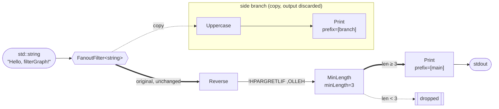
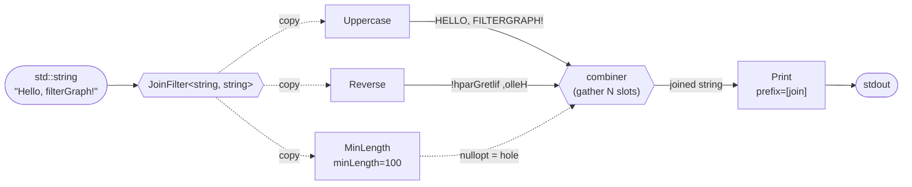
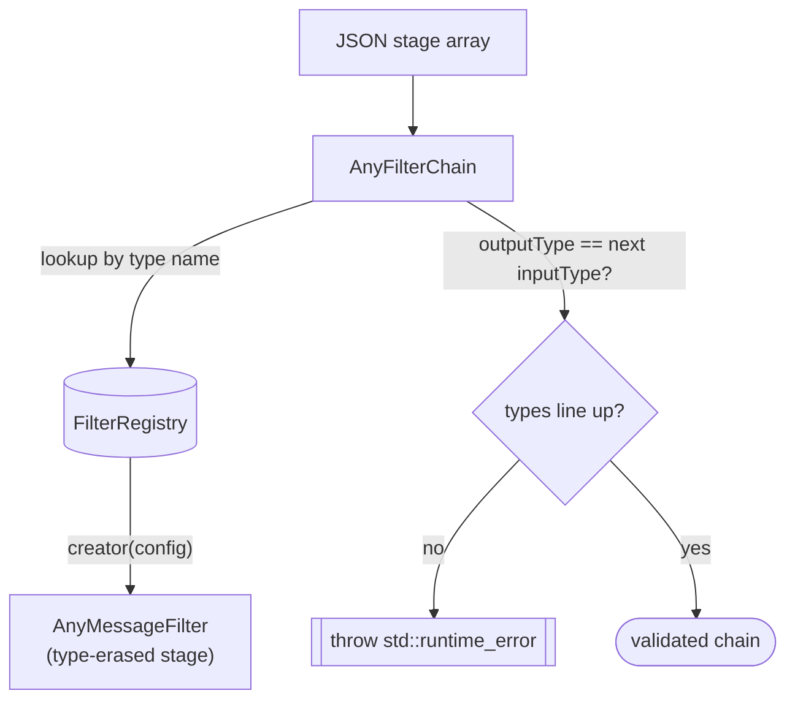

# filterGraph by example

This walkthrough follows the runnable sample in
[`apps/textPipeline/main.cpp`](apps/textPipeline/main.cpp), a small text
pipeline that exercises every core building block: a **compile-time**
`FilterGraph`, and a **runtime**, JSON-configured `JsonFilterGraph` with a
parallel `FanoutFilter` branch and a scatter-gather `JoinFilter`.

## Core concept: a chain of stages

Every stage is a `MessageFilter<InputType, OutputType>`. It consumes an
`InputType&&` and returns `std::optional<OutputType>`. Each stage's `OutType`
feeds the next stage's `InType`, forming a chain. Returning `std::nullopt`
**short-circuits** the chain: no later stage runs.

The short-circuit is handled by the container (`FilterGraph` /
`AnyFilterChain`), not by the stages. As soon as a stage returns
`std::nullopt`, the chain stops and propagates `std::nullopt` out as its own
result. A downstream stage only ever receives a real, unwrapped value, so
stages never have to handle an empty optional as input — their only
responsibility is deciding whether to emit `std::nullopt` themselves. Within a
`FanoutFilter` branch the same rule applies, but the termination is confined to
that branch and never reaches the main path.

A stage's last `OutputType` is normally the graph's own result: a path
typically ends in a stage that produces a real value (e.g. `JsonFilterGraph<In,
Out>` yields an `Out`). A stage may instead declare `MessageFilter<InputType,
Void>` to mark the path as a pure side-effect *sink* — it deliberately produces
no consumable output, so the path ends there. This is distinct from
`std::nullopt`, which means a single message was dropped or could not be
processed. A `Void` stage must be the last stage in a path.


The whole chain is *itself* a `MessageFilter<FirstIn, LastOut>`, so a graph can
be nested inside another graph anywhere a single stage is expected.

## 1. Compile-time pipeline

The compile-time `FilterGraph<Filters...>` composes stages via variadic
templates. Types are checked by the compiler: each stage's `OutType` must equal
the next stage's `InType`, with zero runtime configuration overhead.

```cpp
using Pipeline = FilterGraph<UppercaseFilter, ReverseFilter, PrintFilter>;
Pipeline pipeline(
    std::make_shared<UppercaseFilter>(),
    std::make_shared<ReverseFilter>(),
    std::make_shared<PrintFilter>("[compile-time] "));

pipeline.filter(std::string{"Hello, filterGraph!"});
```


Output:

```text
[compile-time] !HPARGRETLIF ,OLLEH
```

## 2. Runtime, JSON-configured pipeline with a fan-out branch

The same stages are registered by name (via `FilterRegistrar` /
`registerFanoutFilter`) and assembled at runtime from JSON. A `FanoutFilter`
duplicates the incoming message to one or more independent branches (each a
full multi-stage path), then passes the **original** message through unchanged
to the rest of the main path.

```json
[
    { "type": "Fanout", "config": { "branches": [
        [ { "type": "Uppercase" }, { "type": "Print", "config": { "prefix": "[branch] " } } ]
    ] } },
    { "type": "Reverse" },
    { "type": "MinLength", "config": { "minLength": 3 } },
    { "type": "Print", "config": { "prefix": "[main] " } }
]
```

```cpp
JsonFilterGraph<std::string, int> pipeline(pipelineConfig);
pipeline.filter(std::string{"Hello, filterGraph!"});
pipeline.filter(std::string{"ab"}); // dropped by MinLength on the main path
```



Output for the two inputs:

```text
[branch] HELLO, FILTERGRAPH!
[main] !HPARGRETLIF ,OLLEH
```

The second call, `"ab"`, is copied to the branch (which uppercases and prints
it), but on the main path `MinLength` returns `std::nullopt`, so it is dropped
before the final `[main]` print.

> Note: branch order vs. main-path order is a side-effect of how the fanout
> runs its branches before returning the original message; the branch print
> happens first.

### Which branch contributes to the output?

None of them. A `FanoutFilter` is a pure *tap*: it hands each branch its own
copy of the message, runs every branch to completion, and **discards each
branch's result**. Whatever the branches compute (or whether a branch
short-circuits with `std::nullopt`) never affects the main path — the value the
fanout forwards downstream is always the unchanged original input. This holds
regardless of how many branches there are or in what order they run; branches
matter only for their side effects (logging, forwarding, metrics). If you need
a branch's result to feed the output, that requires a separate merge/reduce
stage — `FanoutFilter` deliberately does not merge.

## 3. Join: scatter-gather (the mirror of fan-out)

Where `FanoutFilter` splits 1→N and discards branch results, `JoinFilter`
gathers N→1: it scatters the **same** input (a copy) through N independent,
multi-stage paths, then hands their outputs to a **combiner** that produces a
single result. Paths may emit different types, so their results are gathered
type-erased (one `std::any` slot per path, in order). The combiner is supplied
in C++ (via `registerJoinFilter<In, Out>`), since it cannot be expressed in
JSON; the paths themselves come from configuration.

A path that short-circuits with `std::nullopt` leaves an **empty slot** (a
"hole"): the combiner sees whatever arrived and decides how to treat the
missing paths. A `Void`-terminated path produces no value to gather and is
rejected at construction.

```json
[
    { "type": "Join", "config": { "paths": [
        [ { "type": "Uppercase" } ],
        [ { "type": "Reverse" } ],
        [ { "type": "MinLength", "config": { "minLength": 100 } } ]
    ] } },
    { "type": "Print", "config": { "prefix": "[join] " } }
]
```

The combiner concatenates the present outputs with `" | "` and reports how many
holes it saw:

```cpp
registerJoinFilter<std::string, std::string>(
    "Join",
    [](std::vector<std::any>&& outputs) -> std::optional<std::string> {
        std::string joined;
        std::size_t holes = 0;
        for (auto& out : outputs)
        {
            if (!out.has_value()) { ++holes; continue; } // dropped path -> hole
            if (!joined.empty()) { joined += " | "; }
            joined += std::any_cast<std::string>(out);
        }
        return joined + std::format(" ({} hole{})", holes, holes == 1 ? "" : "s");
    });
```



Output:

```text
[join] HELLO, FILTERGRAPH! | !hparGretlif ,olleH (1 hole)
```

The `MinLength=100` path drops the 19-character input, so its slot is a hole;
the combiner skips it, joins the two transformed outputs, and notes the single
missing path.

## How construction-time validation works

`AnyFilterChain` resolves each stage by name through the global
`FilterRegistry`, then checks that consecutive stages' erased types line up
(`outputType()` of one must equal `inputType()` of the next). `JsonFilterGraph`
additionally validates that the chain's first `inputType()` and last
`outputType()` match its own `InputType`/`OutputType`. Any mismatch throws at
construction time — the pipeline fails fast, before a single message flows.



## Pre-flight validation: collect every problem at once

Construction fails fast — it throws on the *first* problem, with no location.
When you are authoring a config, `validateGraph` is the friendlier counterpart:
it walks the same JSON **without running any messages** and returns **all** the
problems it finds, each carrying a JSON pointer to the offending node.

```cpp
#include <filterGraph/core/filterGraph/GraphValidator.hpp>

for (const auto& d : filterGraph::validateGraph(config))
{
    std::cout << d.pointer << ": " << d.message << '\n';
}
```

Given a config with a typo and a nested mistake:

```json
[
    { "type": "Uppercas" },
    { "type": "Join", "config": { "paths": [
        [ { "type": "Revrse" } ]
    ] } }
]
```

it reports both, located:

```text
/0: unknown filter type 'Uppercas' — did you mean 'Uppercase'? (known types: Join, Reverse, Uppercase, ...)
/1/config/paths/0/0: unknown filter type 'Revrse' — did you mean 'Reverse'? (known types: ...)
```

It catches unknown/typo'd stage types (with a nearest-name suggestion and the
list of known types), structural mistakes (a non-object stage, a missing
`type`, a composite's sub-paths that aren't an array), adjacent type mismatches
between leaf stages, and bad or missing per-stage `config` (leaf stages are
constructed to check). Two things it deliberately does **not** check: a graph's
own declared input/output types (those live in C++ template parameters, not
JSON), and the through-type *across* a composite stage (Fanout/Join), whose
type is branch-/combiner-defined and not knowable from JSON alone.

## Build & run this example

```powershell
# Configure + build (pick a preset for your toolchain from CMakePresets.json)
cmake --preset windows-msvc-release-user-mode
cmake --build --preset windows-msvc-release-user-mode

# Run the sample
./out/build/windows-msvc-release-user-mode/apps/textPipeline/textPipeline
```

On Linux/macOS, use a matching preset such as `unixlike-gcc-release` or
`unixlike-clang-release`.
