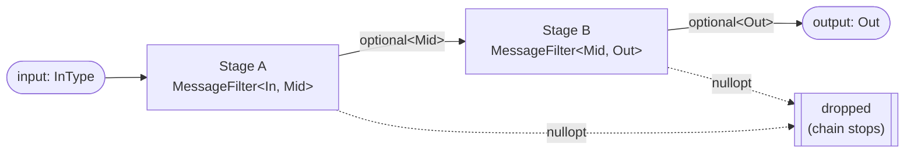
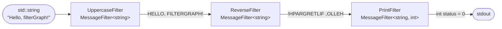
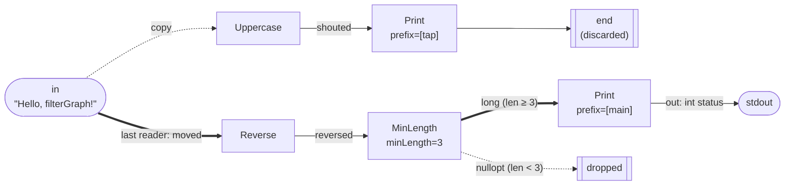
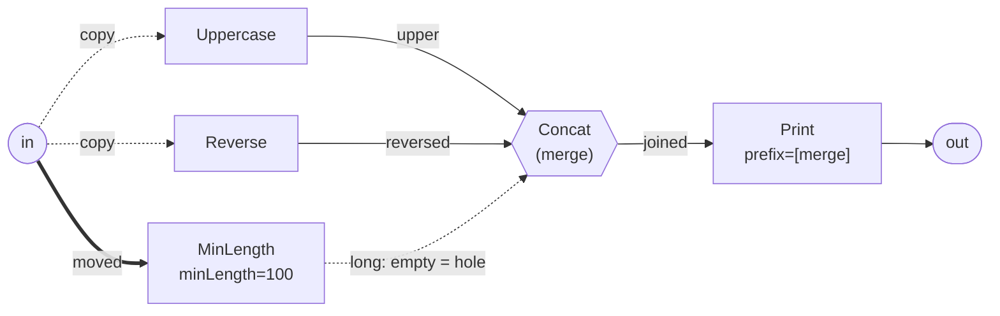
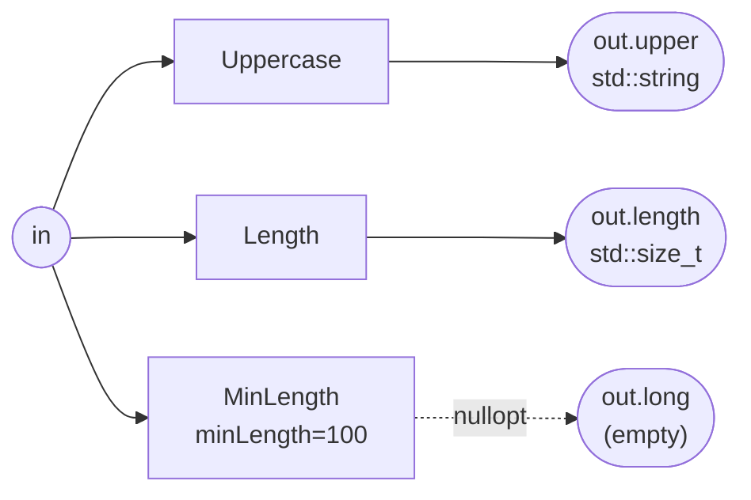
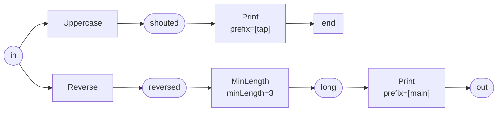
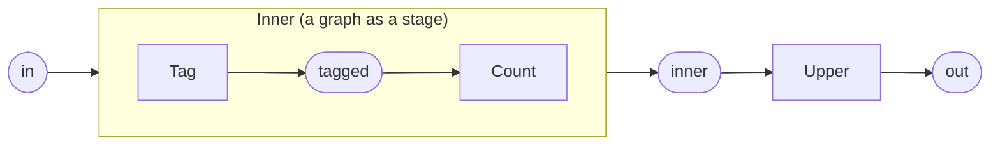
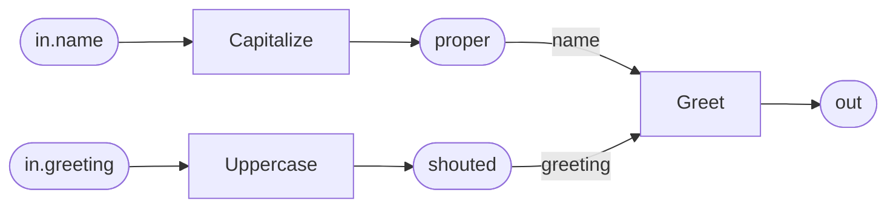
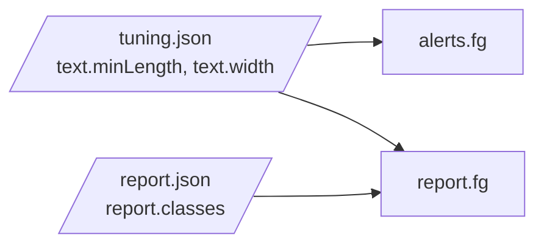

# filterGraph by example

This walkthrough follows five runnable samples under [`apps/`](apps/), all of
them small text pipelines:

| Sections | Sample | Covers |
| --- | --- | --- |
| 1–7 | [`textPipeline`](apps/textPipeline/main.cpp) | the core building blocks: a **compile-time** `FilterGraph`, **runtime graphs in the text DSL** (a tap, a merge, several named outputs, up-front diagnostics) and the same pipeline in the **JSON format** |
| 8 | [`statefulPipeline`](apps/statefulPipeline/main.cpp) | stages that **carry state**: `finish()`, the `GraphContext`, a merge with per-instance state |
| 9 | [`compositePipeline`](apps/compositePipeline/main.cpp) | **composition**: `JoinFilter`, a graph nested as a stage, a `Void` sink, in-band ticks |
| 10 | [`namedPipeline`](apps/namedPipeline/main.cpp) | **names in the wiring**: named merge slots, several named graph inputs (also read directly by a merge), and the checks both make possible |
| 11 | [`tunedPipeline`](apps/tunedPipeline/main.cpp) | **parameters**: graph files that share their tuning values through a parameter file, one-off overrides, and the checks for misspelled names |

Start at the top: sections 8–11 assume the vocabulary of 1–7.

## Core concept: a chain of stages

Every stage is a `MessageFilter<InputType, OutputType>`. It consumes an
`InputType&&` and returns `std::optional<OutputType>`. Each stage's `OutType`
feeds the next stage's `InType`, forming a chain. Returning `std::nullopt`
**short-circuits** the chain: no later stage runs.

The short-circuit is handled by the graph (`FilterGraph`, `DslFilterGraph`,
`JsonFilterGraph`), not by the stages. As soon as a stage returns
`std::nullopt`, everything downstream of it is skipped. A downstream stage only
ever receives a real, unwrapped value, so stages never have to handle an empty
optional as input — their only responsibility is deciding whether to emit
`std::nullopt` themselves.

A path normally ends in a stage that produces a real value (the graph's
result). A stage may instead declare `MessageFilter<InputType, Void>` to mark
the path as a pure side-effect *sink* — it deliberately produces no consumable
output. This is distinct from `std::nullopt`, which means a single message was
dropped or could not be processed.



Every graph is *itself* a `MessageFilter<In, Out>`, so a graph can be nested
inside another graph anywhere a single stage is expected.

## 1. Compile-time pipeline

The compile-time `FilterGraph<Filters...>` composes stages via variadic
templates. Types are checked by the compiler: each stage's `OutType` must equal
the next stage's `InType`, with zero runtime configuration overhead.

```cpp
using Pipeline = FilterGraph<UppercaseFilter, ReverseFilter, PrintFilter>;
Pipeline pipeline(
    std::make_shared<UppercaseFilter>(),
    std::make_shared<ReverseFilter>(),
    std::make_shared<PrintFilter>("[compile-time] "));

pipeline.filter(std::string{"Hello, filterGraph!"});
```



Output:

```text
[compile-time] !HPARGRETLIF ,OLLEH
```

## 2. Registering stages by name

A runtime graph refers to stages by name, so each stage is registered once
with `FilterRegistrar`. Stages that take arguments supply a creator that reads
them from a JSON object:

```cpp
static FilterRegistrar<UppercaseFilter> registerUppercase("Uppercase");
static FilterRegistrar<ReverseFilter>   registerReverse("Reverse");
static FilterRegistrar<LengthFilter>    registerLength("Length"); // string -> std::size_t

// Stage arguments, e.g. `MinLength(minLength=3)`, arrive as a JSON object.
static FilterRegistrar<MinLengthFilter> registerMinLength(
    "MinLength",
    [](const nlohmann::json& config) {
        return std::make_shared<MinLengthFilter>(config.at("minLength").get<std::size_t>());
    });

static FilterRegistrar<PrintFilter> registerPrint(
    "Print",
    [](const nlohmann::json& config) {
        return std::make_shared<PrintFilter>(config.value("prefix", std::string{}));
    });
```

The same registry serves both the DSL and the JSON format.

## 3. A runtime graph in the DSL, with a tap

A DSL graph is a list of statements. Each statement alternates **edges** (named
values) and **stages**, joined by `->`. `in` is the graph's input, `out` its
output, and `end` discards a value.

```text
in -> Uppercase -> shouted -> Print(prefix="[tap] ") -> end
in -> Reverse -> reversed -> MinLength(minLength=3) -> long -> Print(prefix="[main] ") -> out
```

Both statements read `in`, which **fans the message out**: each reader gets its
own copy. The first statement is a *tap* — it uppercases and prints its copy,
then discards the result at `end`. The second is the main path: it reverses the
message, drops it if it is too short, and prints it as the graph's output.

```cpp
DslFilterGraph<std::string, int> pipeline(R"dsl(
    in -> Uppercase -> shouted -> Print(prefix="[tap] ") -> end
    in -> Reverse -> reversed -> MinLength(minLength=3) -> long -> Print(prefix="[main] ") -> out
)dsl");

pipeline.filter(std::string{"Hello, filterGraph!"});
pipeline.filter(std::string{"ab"}); // tapped, then dropped by MinLength on the main path
```

> The raw string uses a custom delimiter (`R"dsl(...)dsl"`) because the graph
> text contains `")`, which would end a plain `R"(...)"` literal.



Output for the two inputs:

```text
[tap] HELLO, FILTERGRAPH!
[main] !hparGretlif ,olleH
[tap] AB
```

A few things to notice:

- **Stages run in the order they are written**, so the tap prints first. (A
  stage whose input comes from a later statement simply waits until that edge
  has been produced.)
- **The main path sees the original message**, not the tap's uppercased copy:
  the tap works on its own copy, so `[main]` prints the reversed, mixed-case
  text.
- **`"ab"` is tapped, then dropped.** `MinLength` returns `std::nullopt`, which
  leaves the edge `long` empty, so the final `Print` is skipped and the graph
  returns `std::nullopt` for that message.

## 4. Fan-in: merging paths

A **merge** stage gathers several edges into one value. Writing
`(a, b, c) -> Merge` passes the merge one `MergeInputs` slot
(`std::vector<std::any>`) per edge, in the order listed. The combiner lives in
C++ and is registered with `registerMergeFilter`:

```cpp
registerMergeFilter<std::string>(
    "Concat",
    [](MergeInputs&& inputs) -> std::optional<std::string> {
        std::string joined;
        std::size_t holes = 0;
        for (auto& input : inputs)
        {
            if (!input.has_value()) { ++holes; continue; } // dropped path -> hole
            if (!joined.empty()) { joined += " | "; }
            joined += std::any_cast<std::string>(input);
        }
        return joined + std::format(" ({} hole{})", holes, holes == 1 ? "" : "s");
    });
```

Three paths read the same input, and the merge combines them:

```cpp
DslFilterGraph<std::string, int> pipeline(R"dsl(
    in -> Uppercase -> upper
    in -> Reverse -> reversed
    in -> MinLength(minLength=100) -> long
    (upper, reversed, long) -> Concat -> joined -> Print(prefix="[merge] ") -> out
)dsl");

pipeline.filter(std::string{"Hello, filterGraph!"});
```



Output:

```text
[merge] HELLO, FILTERGRAPH! | !hparGretlif ,olleH (1 hole)
```

The `MinLength=100` path drops the 19-character input, so its slot is a
**hole**; the combiner skips it, joins the two transformed outputs, and notes
the missing path. A merge is skipped only when *every* one of its edges is
empty — then there is nothing to combine, and the drop propagates.

### Typed slots

`Concat` takes its slots untyped: nothing checks that the group really carries
three strings, and swapping two edges of the same type would pass validation
and quietly produce a different result. A merge that declares its slot types
avoids both. `TypedMergeFilter<Out, Ins...>` fixes the number and type of the
slots and hands them over as `std::optional`s:

```cpp
class ReportFilter : public TypedMergeFilter<std::string, std::string, std::size_t>
{
public:
    std::optional<std::string> merge(std::optional<std::string>&& upper,
                                     std::optional<std::size_t>&& length) override
    {
        return std::format("{} ({} chars)", upper.value_or("-"), length.value_or(0));
    }
};
static FilterRegistrar<ReportFilter> registerReport("Report");
```

```cpp
DslFilterGraph<std::string, int> pipeline(R"dsl(
    in -> Uppercase -> upper
    in -> Length -> length
    (upper, length) -> Report -> reported -> Print(prefix="[typed] ") -> out
)dsl");

pipeline.filter(std::string{"Hello, filterGraph!"});
```

```text
[typed] HELLO, FILTERGRAPH! (19 chars)
```

Writing the group the other way round is now rejected when the graph is built,
instead of throwing `std::bad_any_cast` on the first message:

```text
3:20: slot 1 of 'Report' expects 'class std::basic_string<char,...>' but edge 'length' carries 'unsigned __int64'
3:20: slot 2 of 'Report' expects 'unsigned __int64' but edge 'upper' carries 'class std::basic_string<char,...>'
```

(The type names come from `typeid(...).name()`, so their spelling depends on the
compiler; they are shortened here.)

`registerTypedMergeFilter<Out, Ins...>(name, lambda)` does the same from a
lambda, and `UniformMergeFilter<In, Out>` covers the other shape: any number of
slots, all of the same type (N variants of one computation, combined).

When two slots have the *same* type, their types cannot tell them apart; a
merge can then name its slots. Section 10 shows how.

## 5. Several named outputs

A graph can have more than one output. `out.<key>` names each one, and the
outputs may have different types. With `GraphOutputs` as the graph's output
type (the default), `filter()` returns all of them:

```cpp
DslFilterGraph<std::string> analysis(R"dsl(
    in -> Uppercase -> out.upper
    in -> Length -> out.length
    in -> MinLength(minLength=100) -> out.long
)dsl");

auto outputs = analysis.filter(std::string{"Hello, filterGraph!"});
std::cout << std::format("[outputs] upper={} length={} long={}\n",
                         *outputs->get<std::string>("upper"),
                         *outputs->get<std::size_t>("length"),
                         outputs->has("long") ? "present" : "dropped");
```



Output:

```text
[outputs] upper=HELLO, FILTERGRAPH! length=19 long=dropped
```

Outputs can also be read by position (`get<T>(1)`) or moved out (`take<T>`).
The graph's output type decides what shape is allowed:

| `OutputType` | Graph must have | `filter()` returns |
| --- | --- | --- |
| a concrete type (sections 3 and 4 use `int`) | exactly one `-> out` of that type | the value, or `std::nullopt` if dropped |
| `GraphOutputs` | one or more `-> out` / `-> out.<key>` | all outputs; `std::nullopt` only if all were dropped |
| `Void` | no outputs, only `-> end` | `Void{}` |

The mirror image, a graph with several named *inputs*, is in section 10.

## 6. Checking a graph before it runs

Constructing a `DslFilterGraph` checks the whole graph before any message
flows, and reports **every** problem at once, each located by `line:column`.
`validateDslGraph` runs the same checks and returns the diagnostics instead of
throwing:

```cpp
const auto diagnostics = validateDslGraph<std::string, int>(
    "in -> Uppercas -> shouted -> Print -> out\n"
    "in -> MinLength -> long -> Print -> end\n");

for (const auto& diagnostic : diagnostics)
{
    std::cout << "[check] " << dsl::formatDiagnostic(diagnostic) << '\n';
}
```

Output:

```text
[check] 1:7: unknown stage type 'Uppercas' — did you mean 'Uppercase'?
[check] 2:7: could not construct 'MinLength': [json.exception.out_of_range.403] key 'minLength' not found
```

Constructing a `DslFilterGraph` from the same text throws a `GraphError` whose
`what()` lists the same lines and whose `diagnostics()` returns them.


What gets checked:

- **Syntax** — a statement must alternate edges and stages; `in` only starts a
  statement, `out`/`end` only end one.
- **Names** — unknown stages, with a "did you mean" suggestion.
- **Wiring** — an edge read but never written, written twice, or written but
  never read; duplicate output keys; cycles.
- **Arguments** — every stage is constructed, so bad or missing arguments are
  reported.
- **Types** — every edge's type must match what its reader expects, starting
  from the graph's `InputType` at `in`. A mismatch names the stage, the edge and
  both types (type names come from `typeid`, so their spelling depends on the
  compiler).
- **Fan-in and `Void`** — groups must feed merge stages, merge stages need a
  group, and a stage producing `Void` must route to `end`. A merge that
  declares its slot types (`TypedMergeFilter`, `UniformMergeFilter`) also has
  the number and type of its group's edges checked.
- **Outputs** — the number and type of outputs must fit the graph's
  `OutputType`.

### Visualizing a graph

`dsl::toMermaid` renders a parsed graph as a Mermaid flowchart. For the graph in
section 3, `dsl::toMermaid(pipeline.program())` produces:



`dsl::toDot` renders the same picture, with the same node ids, as a Graphviz
DOT digraph. Pipe it into `dot -Tsvg -o pipeline.svg` for an image, or into
`graph-easy --as=boxart` to draw it in a console.

Without any tool, `dsl::toAscii(pipeline.program())` prints it as a listing,
one tree per input:

```text
in
+-> Uppercase -> shouted
|   `-> Print(prefix="[tap] ") -> end
`-> Reverse -> reversed
    `-> MinLength(minLength=3) -> long
        `-> Print(prefix="[main] ") -> out
```

## 7. The same pipeline in JSON

The JSON format remains supported and uses the same registered stages. JSON
chains are linear, so branching needs composite stages: here a `Fanout`
(registered with `registerFanoutFilter<std::string>("Fanout")`) runs a side
branch on a copy and passes the original on — the tap from section 3:

```cpp
auto pipelineConfig = nlohmann::json::parse(R"json([
    { "type": "Fanout", "config": { "branches": [
        [ { "type": "Uppercase" }, { "type": "Print", "config": { "prefix": "[json tap] " } } ]
    ] } },
    { "type": "Reverse" },
    { "type": "MinLength", "config": { "minLength": 3 } },
    { "type": "Print", "config": { "prefix": "[json main] " } }
])json");

JsonFilterGraph<std::string, int> pipeline(pipelineConfig);
pipeline.filter(std::string{"Hello, filterGraph!"});
```

Output:

```text
[json tap] HELLO, FILTERGRAPH!
[json main] !hparGretlif ,olleH
```

How the DSL constructs map to JSON:

| DSL | JSON |
| --- | --- |
| a second reader of an edge, ending in `end` | a `Fanout` stage with `"branches"` |
| several readers of one edge, then `(a, b) -> Merge` | a `Join` stage (`registerJoinFilter<In, Out>`) with `"paths"` and a C++ combiner |
| `Stage(key=value)` | `{ "type": "Stage", "config": { "key": value } }` |
| several outputs (`out.<key>`) | not expressible; a JSON chain has one output |

`validateGraph(config)` checks a JSON config without running messages and
returns every problem, located by a JSON pointer such as `/1/config/paths/0/0`.
Unlike the DSL checks, it cannot see the graph's declared input/output types,
and it stops type-checking across a `Fanout` or `Join`.

## 8. Stateful stages: `finish()` and the graph context

The sections above transform one message at a time. Stages may also **carry
state**: a stage instance lives as long as the graph it belongs to, so state in
its members persists across messages, and every graph construction creates
fresh instances. The second sample,
[`apps/statefulPipeline/main.cpp`](apps/statefulPipeline/main.cpp), is about
those stages.

A stage that accumulates something has no natural point at which to report it —
it only ever runs because a message arrived. `finish()` is that point:

```cpp
class CollectFilter : public MessageFilter<std::string>
{
public:
    std::optional<std::string> filter(std::string&& line) override
    {
        ++mSummary.lines;
        mSummary.words += countWords(line);
        return std::move(line);      // the line itself passes through unchanged
    }

    void finish() override           // once, after the last message
    {
        std::cout << std::format("[collect] end of stream: {} lines, {} words\n",
                                 mSummary.lines, mSummary.words);
        context().set(mSummary);     // hand the result to the application
    }

private:
    Summary mSummary;
};
```

`finish()` produces no message, so a final *result* travels through the
[graph context](README.md#graph-context) instead — a type-keyed blackboard that
every stage of a graph shares:

```cpp
DslFilterGraph<std::string, std::string> graph("in -> Collect -> out");

for (auto line : lines) { graph.filter(std::move(line)); }
graph.finish();                                    // the owner's call

const auto summary = graph.context().get<Summary>(); // std::optional<Summary>
```

```text
[collect] end of stream: 3 lines, 12 words
[app] read from the context: 3 lines, 12 words
```

Nothing is reported while messages flow, and a graph that is never finished
never flushes.

### A merge with per-instance state

A merge stage may hold state too, but *how* it is registered decides whether
that state is per instance or shared. Subclassing and registering a creator
gives every instance its own — here a `TypedMergeFilter` with a sliding window
whose size comes from the stage's arguments:

```cpp
class TrendFilter : public TypedMergeFilter<std::string, std::size_t, std::size_t>
{
public:
    explicit TrendFilter(std::size_t window) : mWindow(window) {}

    std::optional<std::string> merge(std::optional<std::size_t>&& length,
                                     std::optional<std::size_t>&& words) override
    { /* push length into mLengths, drop the oldest, average what is left */ }

private:
    std::size_t             mWindow;
    std::deque<std::size_t> mLengths;
};

static FilterRegistrar<TrendFilter> registerTrend("Trend", [](const nlohmann::json& config) {
    return std::make_shared<TrendFilter>(config.value("window", std::size_t{3}));
});
```

```text
in -> Length -> length
in -> Words  -> words
(length, words) -> Trend(window=2) -> out.short
(length, words) -> Trend(window=3) -> out.long
```

Two instances of one stage type, each with its own window and its own history:

```text
[trend] short: chars=19 words=4 avg(last 2)=19.0
[trend] long:  chars=19 words=4 avg(last 3)=19.0
[trend] short: chars=10 words=2 avg(last 2)=14.5
[trend] long:  chars=10 words=2 avg(last 3)=14.5
[trend] short: chars=30 words=6 avg(last 2)=20.0
[trend] long:  chars=30 words=6 avg(last 3)=19.7
```

`registerMergeFilter` (and `registerTypedMergeFilter`) behave differently on
purpose: they **copy one combiner into every instance**, so whatever the
combiner captures is shared by all of them — across instances *and* across
graphs. The sample registers such a merge with a captured counter and uses it
twice in one graph:

```text
[tally] call 1 of the one shared combiner (2 slots) / call 2 of the one shared combiner (2 slots)
[tally] call 3 of the one shared combiner (2 slots) / call 4 of the one shared combiner (2 slots)
[tally] call 5 of the one shared combiner (2 slots) / call 6 of the one shared combiner (2 slots)
```

The numbers run straight through both stages. For a stateless combiner that is
exactly what you want; for state, use the `Trend` pattern above.

### An application's own context

`GraphContext` is a polymorphic base, so an application can derive its own and
hand it to the graph. A stage recovers it with `as<AppContext>()`:

```cpp
class AppContext : public GraphContext
{
public:
    explicit AppContext(std::string session) : sessionId(std::move(session)) {}
    std::string sessionId;
};

auto context = std::make_shared<AppContext>("session-42");
graph.setContext(context);      // give it to the GRAPH, not to single stages
```

```cpp
const auto* app = context().as<AppContext>();   // nullptr if it is another type
return app ? std::format("[{}] {}", app->sessionId, line) : std::move(line);
```

Give the context to the graph: a graph overwrites its stages' contexts with its
own when they are built, so a context handed to a single stage would be
replaced. A stage that calls `as<Derived>()` depends on that type, so reusable
stages should stick to the type-keyed `set`/`get`.

## 9. Composition: joins, nested graphs, sinks and ticks

Every graph is itself a `MessageFilter`, which is what makes graphs composable.
The third sample,
[`apps/compositePipeline/main.cpp`](apps/compositePipeline/main.cpp), puts the
composition features side by side.

### A typed merge from a lambda, and its JSON twin

Section 4 registered a merge from a combiner and section 4's *typed slots*
subsection subclassed `TypedMergeFilter`. `registerTypedMergeFilter` is the
third way: typed slots, registered from a lambda.

```cpp
registerTypedMergeFilter<std::string, std::string, std::string>(
    "Concat",
    [](std::optional<std::string>&& upper,
       std::optional<std::string>&& reversed) -> std::optional<std::string> {
        return std::format("{} | {}", upper.value_or("-"), reversed.value_or("-"));
    });
```

```text
in -> Upper   -> upper
in -> Reverse -> reversed
(upper, reversed) -> Concat -> out
```

The JSON format expresses the same shape as a **`JoinFilter`**: it scatters a
copy of the message through each configured path and hands the gathered results
to a C++ combiner (the paths come from configuration, the combiner cannot).

```cpp
registerJoinFilter<std::string, std::string>("Join", [](std::vector<std::any>&& slots) {
    /* one slot per path, in path order; an empty slot is a hole */
});
```

```json
[
  { "type": "Join", "config": { "paths": [
      [ { "type": "Upper" } ],
      [ { "type": "Reverse" } ]
  ] } }
]
```

Both print the same thing:

```text
[dsl]  COMPOSE ME | em esopmoc
[json] COMPOSE ME | em esopmoc
```

### A graph as a stage

A `DslFilterGraph` can be registered like any other stage, which makes a whole
graph reusable inside another:

```cpp
static FilterRegistrar<DslFilterGraph<std::string, std::string>> registerInner(
    "Inner", [](const nlohmann::json&) {
        return std::make_shared<DslFilterGraph<std::string, std::string>>(
            "in -> Tag -> tagged -> Count -> out");
    });
```

```text
in -> Inner -> inner -> Upper -> out
```



The outer graph hands its context to the nested one, and finishing the outer
graph finishes the inner stages too — so `Tag` sees a value the *application*
published, and `Count` reports when the outer graph is finished:

```cpp
graph.context().set(Tag{"[tagged] "});
graph.filter(std::string{"nested graphs compose"});
graph.filter(std::string{"and share a context"});
graph.finish();
```

```text
[outer] [TAGGED] NESTED GRAPHS COMPOSE
[outer] [TAGGED] AND SHARE A CONTEXT
[nested] the inner stage saw 2 message(s)
```

### A graph that only has side effects

When every path ends in a sink, the graph has no consumable output: its stages
are declared `MessageFilter<InputType, Void>` and its paths end in `end`.
`Void` is a deliberate dead end, unlike `std::nullopt`, which means a message
was dropped.

```cpp
class WriteFilter : public MessageFilter<std::string, Void>
{
public:
    std::optional<Void> filter(std::string&& text) override
    {
        std::cout << "[sink] " << text << '\n';
        return Void{};
    }
};

DslFilterGraph<std::string, Void> graph(R"dsl(
    in -> Upper   -> upper    -> Write -> end
    in -> Reverse -> reversed -> Write -> end
)dsl");

const auto ran = graph.filter(std::string{"side effects only"}); // optional<Void>
```

```text
[sink] SIDE EFFECTS ONLY
[sink] ylno stceffe edis
[sink] the graph ran: true
```

### Time: the in-band tick message

There is no `tick()` hook, because time is domain-specific (event time, wall
clock, a sensor clock). A stage that must act while no data arrives is fed
**ticks as messages**: the graph's input type is a variant of the payload and a
`Tick`, so ticks travel the same paths as everything else.

```cpp
struct Tick {};
using Event = std::variant<std::string, Tick>;

class BatchFilter : public MessageFilter<Event, std::string>
{
public:
    std::optional<std::string> filter(Event&& event) override
    {
        if (const auto* line = std::get_if<std::string>(&event))
        {
            mBatch.push_back(*line);
            return std::nullopt;   // buffered: nothing downstream runs
        }
        return flushBatch();       // a Tick emits what has accumulated
    }
    // finish() reports whatever is still buffered when the stream ends
};

DslFilterGraph<Event, std::string> graph("in -> Batch -> out");
```

```text
[batch] first, second
[batch] third
[batch] 1 line(s) left unflushed at the end of the stream
```

## 10. Names in the wiring: merge slots and graph inputs

Positions are enough while a merge's slots have different types and a graph
has one input. The fourth sample,
[`apps/namedPipeline/main.cpp`](apps/namedPipeline/main.cpp), covers the cases
where they are not: a merge whose slots share a type, and a graph that
consumes several kinds of message. Both get names, and the names are checked.

### Named slots

Slot types cannot catch everything: when two slots have the *same* type,
swapping them still passes validation. A merge can name its slots so that the
group says which edge goes where:

```cpp
class CompareFilter : public TypedMergeFilter<std::string, std::string, std::string>
{
public:
    std::optional<std::string> merge(std::optional<std::string>&& before,
                                     std::optional<std::string>&& after) override
    {
        return std::format("{} => {}", before.value_or("-"), after.value_or("-"));
    }

    std::vector<std::string> mergeInputNames() const override
    {
        return {"before", "after"};
    }
};
static FilterRegistrar<CompareFilter> registerCompare("Compare");
```

```cpp
DslFilterGraph<std::string, std::string> compare(R"dsl(
    in -> Uppercase -> upper
    upper -> Reverse -> reversed
    (after: reversed, before: upper) -> Compare -> out
)dsl");

std::cout << "[slots] " << *compare.filter(std::string{"Hello, filterGraph!"}) << '\n';
```

```text
[slots] HELLO, FILTERGRAPH! => !HPARGRETLIF ,OLLEH
```

The group lists `after` first, but the slots are matched by name, so `merge()`
still receives `before` first. A group without names still feeds `Compare` by
position.

The names are checked when the graph is built. Misspell one and both
consequences are reported: the unknown name, and the slot now left unfed:

```text
[slot check] 3:36: 'Compare' has no slot named 'befor' — did you mean 'before'? (its slots: before, after)
[slot check] 3:36: the fan-in group does not feed slot 'before' of 'Compare'
```

### Several named inputs

The mirror image of section 5: a graph can read several named inputs,
`in.<key>`, with `GraphInputs` as its input type. Each `push()` is one run that
feeds a single input; the stages that only an unfed input reaches are skipped,
exactly as if their path had dropped the message. `filter()` takes a
`GraphInputs` and feeds several inputs in the same run:

```cpp
DslFilterGraph<GraphInputs> routes(R"dsl(
    in.greeting -> Uppercase -> out.shouted
    in.name -> Reverse -> out.reversed
)dsl",
                                   GraphInputs::of<std::string, std::string>("greeting", "name"));

auto pushed = routes.push("name", std::string{"filterGraph"});
auto both   = routes.filter(GraphInputs{}.set("greeting", std::string{"hi"}).set("name", std::string{"filterGraph"}));
```

```text
[push]   shouted=not fed reversed=hparGretlif
[filter] shouted=HI reversed=hparGretlif
```

`GraphInputs::of` declares the input types. It is optional; without it, each
input takes the type of the first stage that reads it. With it, the graph is
checked against the declaration when it is built, so a misspelled `in.<key>`
shows up twice:

```text
[input check] 1:1: input 'name' is declared but the graph never reads 'in.name'
[input check] 2:1: the graph reads 'in.nmae', but no input 'nmae' is declared
```

What is fed is checked when it arrives: an unknown key throws
`std::out_of_range`, a value of the wrong type `std::invalid_argument`:

```text
[feed check] DslFilterGraph: the graph has no input named 'nmae'
[feed check] DslFilterGraph: input 'name' expects 'class std::basic_string<char,...>' but received 'int'
```

### Both together

Named inputs and named slots combine naturally: two inputs, each prepared by
its own stage, meet in a merge that names its slots. This one is registered
from a lambda; `registerTypedMergeFilter` takes the slot names, one per slot
type, before the function:

```cpp
registerTypedMergeFilter<std::string, std::string, std::string>(
    "Greet",
    {"greeting", "name"},
    [](std::optional<std::string>&& greeting, std::optional<std::string>&& name) -> std::optional<std::string> {
        return std::format("{}, {}!", greeting.value_or("Hello"), name.value_or("stranger"));
    });
```

```cpp
DslFilterGraph<GraphInputs, std::string> greet(R"dsl(
    in.greeting -> Uppercase -> shouted
    in.name -> Capitalize -> proper
    (name: proper, greeting: shouted) -> Greet -> out
)dsl",
                                               GraphInputs::of<std::string, std::string>("greeting", "name"));

greet.push("name", std::string{"aDA"});
greet.push("greeting", std::string{"good morning"});
greet.filter(GraphInputs{}.set("greeting", std::string{"hi"}).set("name", std::string{"grace"}));
```

An input that is not fed in a run leaves a hole in its slot, which `Greet`
fills with a default:

```text
[greet] Hello, Ada!
[greet] GOOD MORNING, stranger!
[greet] HI, Grace!
```

`dsl::toMermaid(greet.program())` labels the merge's edges with the slot names:



### A merge reading an input directly

Only the name needs preparing; the greeting can go into `Greet` as it arrives.
A group reads `in.<key>` (or plain `in`) like any other edge, so no stage has
to copy the input onto an edge of its own first:

```cpp
DslFilterGraph<GraphInputs, std::string> greet(R"dsl(
    in.name -> Capitalize -> proper
    (greeting: in.greeting, name: proper) -> Greet -> out
)dsl");

greet.push("greeting", std::string{"Welcome"});
greet.filter(GraphInputs{}.set("greeting", std::string{"Welcome"}).set("name", std::string{"lINUS"}));
std::cout << dsl::toAscii(greet.program());
```

Nothing is declared here, so `in.greeting` takes the type of the `greeting`
slot it feeds. As before, the unfed input is a hole:

```text
[direct] Welcome, stranger!
[direct] Welcome, Linus!

in.name
`-> Capitalize -> proper
    `-> Greet (merge, see below)

in.greeting
`-> Greet (merge, see below)

(greeting: in.greeting, name: proper)
`-> Greet -> out
```

## 11. Parameters shared by several graphs

Two graphs that cut lines to a width should cut them to the *same* width. With
the width written into each graph, keeping them in step is a matter of care.
The fifth sample, [`apps/tunedPipeline/main.cpp`](apps/tunedPipeline/main.cpp),
keeps such values in a parameter file that the graphs share, under
[`apps/tunedPipeline/graphs/`](apps/tunedPipeline/graphs/):

```text
# alerts.fg: the long lines, cut to the shared width.
params "tuning.json"

in -> MinLength(minLength=$text.minLength) -> long
long -> Truncate(width=$text.width) -> out
```

```text
# report.fg: every line, cut to the same width as the alerts, and its size class.
params "tuning.json"   # shared with alerts.fg
params "report.json"   # this graph's own parameters

in -> Truncate(width=$text.width) -> out.text
in -> Classify(classes=$report.classes) -> out.size
```

```jsonc
// tuning.json
{ "text": { "minLength": 12, "width": 16 } }

// report.json
{ "report": { "classes": [ { "upTo": 10, "label": "short" },
                           { "upTo": 30, "label": "medium" },
                           { "upTo": 1000, "label": "long" } ] } }
```



- An argument written `$text.width` names a parameter; the dot walks into the
  `text` object. `$report.classes` is a list of objects, which an inline
  argument cannot express.
- The `params` paths are relative to the graph file. When a graph names
  several files, later ones override earlier ones member by member.

### Loading the graphs

```cpp
DslFilterGraph<std::string, std::string> alerts(dsl::loadGraphProgram(graphs / "alerts.fg"));
DslFilterGraph<std::string>              report(dsl::loadGraphProgram(graphs / "report.fg"));
```

`loadGraphProgram` reads the graph file and its parameter files and binds the
parameters; the stages receive them in their config like any other argument.
Both graphs cut at 16 characters, and changing `text.width` in `tuning.json`
changes both:

```text
[shared] short one            short   alert: -
[shared] a line of medium...  medium  alert: a line of medium...
[shared] and a considerab...  long    alert: and a considerab...
```

### One value changed for a run

To try a value out without editing the file, pass overrides; they apply on top
of the files, the same way the files apply on top of each other:

```cpp
DslFilterGraph<std::string, std::string> alerts(
    dsl::loadGraphProgram(graphs / "alerts.fg", {{"text", {{"width", 6}}}}));
```

```text
[override] and a ...
```

### Unbound and bound

`dsl::parseGraphProgram(text)` reads no files, so a program parsed from text
has its parameters unbound, and the renderings show them by name. Binding them,
here from a parameter file read with `dsl::loadParameters`, puts in the values:

```cpp
dsl::toAscii(dsl::parseGraphProgram("in -> Truncate(width=$text.width) -> out"));
dsl::toAscii(dsl::parseGraphProgram("in -> Truncate(width=$text.width) -> out",
                                    dsl::loadParameters(graphs / "tuning.json")));
```

```text
in
`-> Truncate(width=$text.width) -> out

in
`-> Truncate(width=16) -> out
```

A graph built from the unbound program would report
`1:22: parameter '$text.width' is not set; ...`.

### A misspelled parameter

A name no parameter file defines is a located diagnostic, with a suggestion if
one is close. Parameters a graph does not use are fine: `alerts.fg` never reads
`report.classes`, and a shared file will always hold values that some graph
does not need.

```text
[check] 1:22: unknown parameter '$text.widht' — did you mean '$text.width'?
```

## Build & run these examples

```powershell
# Configure + build (pick a preset for your toolchain from CMakePresets.json)
cmake --preset windows-msvc-release-user-mode
cmake --build --preset windows-msvc-release-user-mode

# Run the samples
./out/build/windows-msvc-release-user-mode/apps/textPipeline/textPipeline
./out/build/windows-msvc-release-user-mode/apps/statefulPipeline/statefulPipeline
./out/build/windows-msvc-release-user-mode/apps/compositePipeline/compositePipeline
./out/build/windows-msvc-release-user-mode/apps/namedPipeline/namedPipeline
./out/build/windows-msvc-release-user-mode/apps/tunedPipeline/tunedPipeline
```

`tunedPipeline` finds its graph files in the source tree; pass another
directory as its first argument to load graphs from there.

On Linux/macOS, use a matching preset such as `unixlike-gcc-release` or
`unixlike-clang-release`.

The complete output of `textPipeline` (sections 1–7):

```text
[compile-time] !HPARGRETLIF ,OLLEH
[tap] HELLO, FILTERGRAPH!
[main] !hparGretlif ,olleH
[tap] AB
[merge] HELLO, FILTERGRAPH! | !hparGretlif ,olleH (1 hole)
[typed] HELLO, FILTERGRAPH! (19 chars)
[typed check] 3:20: slot 1 of 'Report' expects 'class std::basic_string<char,...>' but edge 'length' carries 'unsigned __int64'
[typed check] 3:20: slot 2 of 'Report' expects 'unsigned __int64' but edge 'upper' carries 'class std::basic_string<char,...>'
[outputs] upper=HELLO, FILTERGRAPH! length=19 long=dropped
[check] 1:7: unknown stage type 'Uppercas' — did you mean 'Uppercase'?
[check] 2:7: could not construct 'MinLength': [json.exception.out_of_range.403] key 'minLength' not found
[json tap] HELLO, FILTERGRAPH!
[json main] !hparGretlif ,olleH
```

(The `[typed check]` lines print the full `typeid(...).name()` spelling, which
depends on the compiler; it is shortened here.)

Of `statefulPipeline` (section 8):

```text
[collect] end of stream: 3 lines, 12 words
[app] read from the context: 3 lines, 12 words

[trend] short: chars=19 words=4 avg(last 2)=19.0
[trend] long:  chars=19 words=4 avg(last 3)=19.0
[trend] short: chars=10 words=2 avg(last 2)=14.5
[trend] long:  chars=10 words=2 avg(last 3)=14.5
[trend] short: chars=30 words=6 avg(last 2)=20.0
[trend] long:  chars=30 words=6 avg(last 3)=19.7

[tally] call 1 of the one shared combiner (2 slots) / call 2 of the one shared combiner (2 slots)
[tally] call 3 of the one shared combiner (2 slots) / call 4 of the one shared combiner (2 slots)
[tally] call 5 of the one shared combiner (2 slots) / call 6 of the one shared combiner (2 slots)

[stamped] [session-42] the quick brown fox
[stamped] [session-42] jumps over
[stamped] [session-42] the lazy dog and keeps running
[collect] end of stream: 3 lines, 15 words
[app] session session-42 saw 3 lines
```

(15 words, not 12: in that last graph `Stamp` runs before `Collect`, so each
line carries the session stamp as an extra word.)

Of `compositePipeline` (section 9):

```text
[dsl]  COMPOSE ME | em esopmoc
[json] COMPOSE ME | em esopmoc

[outer] [TAGGED] NESTED GRAPHS COMPOSE
[outer] [TAGGED] AND SHARE A CONTEXT
[nested] the inner stage saw 2 message(s)

[sink] SIDE EFFECTS ONLY
[sink] ylno stceffe edis
[sink] the graph ran: true

[batch] first, second
[batch] third
[batch] 1 line(s) left unflushed at the end of the stream
```

And of `namedPipeline` (section 10):

```text
[slots] HELLO, FILTERGRAPH! => !HPARGRETLIF ,OLLEH
[slot check] 3:36: 'Compare' has no slot named 'befor' — did you mean 'before'? (its slots: before, after)
[slot check] 3:36: the fan-in group does not feed slot 'before' of 'Compare'
[push]   shouted=not fed reversed=hparGretlif
[filter] shouted=HI reversed=hparGretlif
[feed check] DslFilterGraph: the graph has no input named 'nmae'
[feed check] DslFilterGraph: input 'name' expects 'class std::basic_string<char,...>' but received 'int'
[input check] 1:1: input 'name' is declared but the graph never reads 'in.name'
[input check] 2:1: the graph reads 'in.nmae', but no input 'nmae' is declared
[greet] Hello, Ada!
[greet] GOOD MORNING, stranger!
[greet] HI, Grace!
```

followed by the Mermaid flowchart and the `[direct]` block shown in section 10.
(The `[feed check]` type name is shortened here too.)

And of `tunedPipeline` (section 11):

```text
[shared] short one            short   alert: -
[shared] a line of medium...  medium  alert: a line of medium...
[shared] and a considerab...  long    alert: and a considerab...
[override] and a ...

in
`-> Truncate(width=$text.width) -> out

in
`-> Truncate(width=16) -> out

[check] 1:22: unknown parameter '$text.widht' — did you mean '$text.width'?
```
