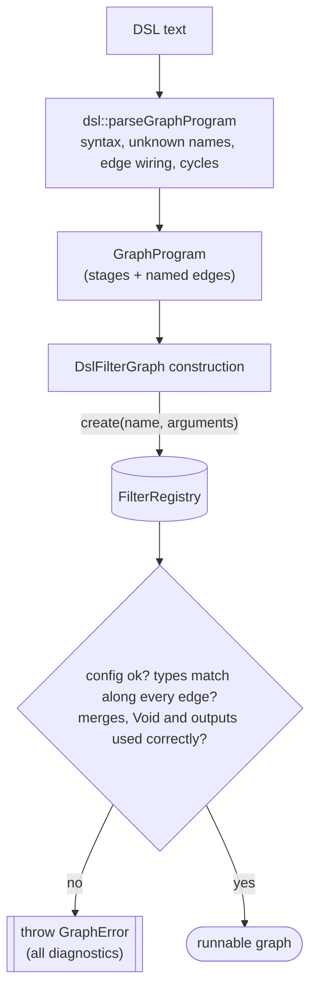

# filterGraph by example

This walkthrough follows the runnable sample in
[`apps/textPipeline/main.cpp`](apps/textPipeline/main.cpp), a small text
pipeline that exercises every core building block: a **compile-time**
`FilterGraph`, then **runtime graphs described in the text DSL** — a tap
(fan-out), a merge (fan-in), several named outputs and up-front diagnostics —
and finally the same kind of pipeline in the **JSON format**.

## Core concept: a chain of stages

Every stage is a `MessageFilter<InputType, OutputType>`. It consumes an
`InputType&&` and returns `std::optional<OutputType>`. Each stage's `OutType`
feeds the next stage's `InType`, forming a chain. Returning `std::nullopt`
**short-circuits** the chain: no later stage runs.

The short-circuit is handled by the graph (`FilterGraph`, `DslFilterGraph`,
`JsonFilterGraph`), not by the stages. As soon as a stage returns
`std::nullopt`, everything downstream of it is skipped. A downstream stage only
ever receives a real, unwrapped value, so stages never have to handle an empty
optional as input — their only responsibility is deciding whether to emit
`std::nullopt` themselves.

A path normally ends in a stage that produces a real value (the graph's
result). A stage may instead declare `MessageFilter<InputType, Void>` to mark
the path as a pure side-effect *sink* — it deliberately produces no consumable
output. This is distinct from `std::nullopt`, which means a single message was
dropped or could not be processed.


Every graph is *itself* a `MessageFilter<In, Out>`, so a graph can be nested
inside another graph anywhere a single stage is expected.

## 1. Compile-time pipeline

The compile-time `FilterGraph<Filters...>` composes stages via variadic
templates. Types are checked by the compiler: each stage's `OutType` must equal
the next stage's `InType`, with zero runtime configuration overhead.

```cpp
using Pipeline = FilterGraph<UppercaseFilter, ReverseFilter, PrintFilter>;
Pipeline pipeline(
    std::make_shared<UppercaseFilter>(),
    std::make_shared<ReverseFilter>(),
    std::make_shared<PrintFilter>("[compile-time] "));

pipeline.filter(std::string{"Hello, filterGraph!"});
```


Output:

```text
[compile-time] !HPARGRETLIF ,OLLEH
```

## 2. Registering stages by name

A runtime graph refers to stages by name, so each stage is registered once
with `FilterRegistrar`. Stages that take arguments supply a creator that reads
them from a JSON object:

```cpp
static FilterRegistrar<UppercaseFilter> registerUppercase("Uppercase");
static FilterRegistrar<ReverseFilter>   registerReverse("Reverse");
static FilterRegistrar<LengthFilter>    registerLength("Length"); // string -> std::size_t

// Stage arguments, e.g. `MinLength(minLength=3)`, arrive as a JSON object.
static FilterRegistrar<MinLengthFilter> registerMinLength(
    "MinLength",
    [](const nlohmann::json& config) {
        return std::make_shared<MinLengthFilter>(config.at("minLength").get<std::size_t>());
    });

static FilterRegistrar<PrintFilter> registerPrint(
    "Print",
    [](const nlohmann::json& config) {
        return std::make_shared<PrintFilter>(config.value("prefix", std::string{}));
    });
```

The same registry serves both the DSL and the JSON format.

## 3. A runtime graph in the DSL, with a tap

A DSL graph is a list of statements. Each statement alternates **edges** (named
values) and **stages**, joined by `->`. `in` is the graph's input, `out` its
output, and `end` discards a value.

```text
in -> Uppercase -> shouted -> Print(prefix="[tap] ") -> end
in -> Reverse -> reversed -> MinLength(minLength=3) -> long -> Print(prefix="[main] ") -> out
```

Both statements read `in`, which **fans the message out**: each reader gets its
own copy. The first statement is a *tap* — it uppercases and prints its copy,
then discards the result at `end`. The second is the main path: it reverses the
message, drops it if it is too short, and prints it as the graph's output.

```cpp
DslFilterGraph<std::string, int> pipeline(R"dsl(
    in -> Uppercase -> shouted -> Print(prefix="[tap] ") -> end
    in -> Reverse -> reversed -> MinLength(minLength=3) -> long -> Print(prefix="[main] ") -> out
)dsl");

pipeline.filter(std::string{"Hello, filterGraph!"});
pipeline.filter(std::string{"ab"}); // tapped, then dropped by MinLength on the main path
```

> The raw string uses a custom delimiter (`R"dsl(...)dsl"`) because the graph
> text contains `")`, which would end a plain `R"(...)"` literal.


Output for the two inputs:

```text
[tap] HELLO, FILTERGRAPH!
[main] !hparGretlif ,olleH
[tap] AB
```

A few things to notice:

- **Stages run in the order they are written**, so the tap prints first. (A
  stage whose input comes from a later statement simply waits until that edge
  has been produced.)
- **The main path sees the original message**, not the tap's uppercased copy:
  the tap works on its own copy, so `[main]` prints the reversed, mixed-case
  text.
- **`"ab"` is tapped, then dropped.** `MinLength` returns `std::nullopt`, which
  leaves the edge `long` empty, so the final `Print` is skipped and the graph
  returns `std::nullopt` for that message.

## 4. Fan-in: merging paths

A **merge** stage gathers several edges into one value. Writing
`(a, b, c) -> Merge` passes the merge one `MergeInputs` slot
(`std::vector<std::any>`) per edge, in the order listed. The combiner lives in
C++ and is registered with `registerMergeFilter`:

```cpp
registerMergeFilter<std::string>(
    "Concat",
    [](MergeInputs&& inputs) -> std::optional<std::string> {
        std::string joined;
        std::size_t holes = 0;
        for (auto& input : inputs)
        {
            if (!input.has_value()) { ++holes; continue; } // dropped path -> hole
            if (!joined.empty()) { joined += " | "; }
            joined += std::any_cast<std::string>(input);
        }
        return joined + std::format(" ({} hole{})", holes, holes == 1 ? "" : "s");
    });
```

Three paths read the same input, and the merge combines them:

```cpp
DslFilterGraph<std::string, int> pipeline(R"dsl(
    in -> Uppercase -> upper
    in -> Reverse -> reversed
    in -> MinLength(minLength=100) -> long
    (upper, reversed, long) -> Concat -> joined -> Print(prefix="[merge] ") -> out
)dsl");

pipeline.filter(std::string{"Hello, filterGraph!"});
```


Output:

```text
[merge] HELLO, FILTERGRAPH! | !hparGretlif ,olleH (1 hole)
```

The `MinLength=100` path drops the 19-character input, so its slot is a
**hole**; the combiner skips it, joins the two transformed outputs, and notes
the missing path. A merge is skipped only when *every* one of its edges is
empty — then there is nothing to combine, and the drop propagates.

### Typed slots

`Concat` takes its slots untyped: nothing checks that the group really carries
three strings, and swapping two edges of the same type would pass validation
and quietly produce a different result. A merge that declares its slot types
avoids both. `TypedMergeFilter<Out, Ins...>` fixes the number and type of the
slots and hands them over as `std::optional`s:

```cpp
class ReportFilter : public TypedMergeFilter<std::string, std::string, std::size_t>
{
public:
    std::optional<std::string> merge(std::optional<std::string>&& upper,
                                     std::optional<std::size_t>&& length) override
    {
        return std::format("{} ({} chars)", upper.value_or("-"), length.value_or(0));
    }
};
static FilterRegistrar<ReportFilter> registerReport("Report");
```

```cpp
DslFilterGraph<std::string, int> pipeline(R"dsl(
    in -> Uppercase -> upper
    in -> Length -> length
    (upper, length) -> Report -> reported -> Print(prefix="[typed] ") -> out
)dsl");

pipeline.filter(std::string{"Hello, filterGraph!"});
```

```text
[typed] HELLO, FILTERGRAPH! (19 chars)
```

Writing the group the other way round is now rejected when the graph is built,
instead of throwing `std::bad_any_cast` on the first message:

```text
3:20: slot 1 of 'Report' expects 'class std::basic_string<char,...>' but edge 'length' carries 'unsigned __int64'
3:20: slot 2 of 'Report' expects 'unsigned __int64' but edge 'upper' carries 'class std::basic_string<char,...>'
```

(The type names come from `typeid(...).name()`, so their spelling depends on the
compiler; they are shortened here.)

`registerTypedMergeFilter<Out, Ins...>(name, lambda)` does the same from a
lambda, and `UniformMergeFilter<In, Out>` covers the other shape: any number of
slots, all of the same type (N variants of one computation, combined).

## 5. Several named outputs

A graph can have more than one output. `out.<key>` names each one, and the
outputs may have different types. With `GraphOutputs` as the graph's output
type (the default), `filter()` returns all of them:

```cpp
DslFilterGraph<std::string> analysis(R"dsl(
    in -> Uppercase -> out.upper
    in -> Length -> out.length
    in -> MinLength(minLength=100) -> out.long
)dsl");

auto outputs = analysis.filter(std::string{"Hello, filterGraph!"});
std::cout << std::format("[outputs] upper={} length={} long={}\n",
                         *outputs->get<std::string>("upper"),
                         *outputs->get<std::size_t>("length"),
                         outputs->has("long") ? "present" : "dropped");
```


Output:

```text
[outputs] upper=HELLO, FILTERGRAPH! length=19 long=dropped
```

Outputs can also be read by position (`get<T>(1)`) or moved out (`take<T>`).
The graph's output type decides what shape is allowed:

| `OutputType` | Graph must have | `filter()` returns |
| --- | --- | --- |
| a concrete type (sections 3 and 4 use `int`) | exactly one `-> out` of that type | the value, or `std::nullopt` if dropped |
| `GraphOutputs` | one or more `-> out` / `-> out.<key>` | all outputs; `std::nullopt` only if all were dropped |
| `Void` | no outputs, only `-> end` | `Void{}` |

## 6. Checking a graph before it runs

Constructing a `DslFilterGraph` checks the whole graph before any message
flows, and reports **every** problem at once, each located by `line:column`.
`validateDslGraph` runs the same checks and returns the diagnostics instead of
throwing:

```cpp
const auto diagnostics = validateDslGraph<std::string, int>(
    "in -> Uppercas -> shouted -> Print -> out\n"
    "in -> MinLength -> long -> Print -> end\n");

for (const auto& diagnostic : diagnostics)
{
    std::cout << "[check] " << dsl::formatDiagnostic(diagnostic) << '\n';
}
```

Output:

```text
[check] 1:7: unknown stage type 'Uppercas' — did you mean 'Uppercase'?
[check] 2:7: could not construct 'MinLength': [json.exception.out_of_range.403] key 'minLength' not found
```

Constructing a `DslFilterGraph` from the same text throws a `GraphError` whose
`what()` lists the same lines and whose `diagnostics()` returns them.



What gets checked:

- **Syntax** — a statement must alternate edges and stages; `in` only starts a
  statement, `out`/`end` only end one.
- **Names** — unknown stages, with a "did you mean" suggestion.
- **Wiring** — an edge read but never written, written twice, or written but
  never read; duplicate output keys; cycles.
- **Arguments** — every stage is constructed, so bad or missing arguments are
  reported.
- **Types** — every edge's type must match what its reader expects, starting
  from the graph's `InputType` at `in`. A mismatch names the stage, the edge and
  both types (type names come from `typeid`, so their spelling depends on the
  compiler).
- **Fan-in and `Void`** — groups must feed merge stages, merge stages need a
  group, and a stage producing `Void` must route to `end`. A merge that
  declares its slot types (`TypedMergeFilter`, `UniformMergeFilter`) also has
  the number and type of its group's edges checked.
- **Outputs** — the number and type of outputs must fit the graph's
  `OutputType`.

### Visualizing a graph

`dsl::toMermaid` renders a parsed graph as a Mermaid flowchart. For the graph in
section 3, `dsl::toMermaid(pipeline.program())` produces:


## 7. The same pipeline in JSON

The JSON format remains supported and uses the same registered stages. JSON
chains are linear, so branching needs composite stages: here a `Fanout`
(registered with `registerFanoutFilter<std::string>("Fanout")`) runs a side
branch on a copy and passes the original on — the tap from section 3:

```cpp
auto pipelineConfig = nlohmann::json::parse(R"json([
    { "type": "Fanout", "config": { "branches": [
        [ { "type": "Uppercase" }, { "type": "Print", "config": { "prefix": "[json tap] " } } ]
    ] } },
    { "type": "Reverse" },
    { "type": "MinLength", "config": { "minLength": 3 } },
    { "type": "Print", "config": { "prefix": "[json main] " } }
])json");

JsonFilterGraph<std::string, int> pipeline(pipelineConfig);
pipeline.filter(std::string{"Hello, filterGraph!"});
```

Output:

```text
[json tap] HELLO, FILTERGRAPH!
[json main] !hparGretlif ,olleH
```

How the DSL constructs map to JSON:

| DSL | JSON |
| --- | --- |
| a second reader of an edge, ending in `end` | a `Fanout` stage with `"branches"` |
| several readers of one edge, then `(a, b) -> Merge` | a `Join` stage (`registerJoinFilter<In, Out>`) with `"paths"` and a C++ combiner |
| `Stage(key=value)` | `{ "type": "Stage", "config": { "key": value } }` |
| several outputs (`out.<key>`) | not expressible; a JSON chain has one output |

`validateGraph(config)` checks a JSON config without running messages and
returns every problem, located by a JSON pointer such as `/1/config/paths/0/0`.
Unlike the DSL checks, it cannot see the graph's declared input/output types,
and it stops type-checking across a `Fanout` or `Join`.

## Build & run this example

```powershell
# Configure + build (pick a preset for your toolchain from CMakePresets.json)
cmake --preset windows-msvc-release-user-mode
cmake --build --preset windows-msvc-release-user-mode

# Run the sample
./out/build/windows-msvc-release-user-mode/apps/textPipeline/textPipeline
```

On Linux/macOS, use a matching preset such as `unixlike-gcc-release` or
`unixlike-clang-release`.

The complete output:

```text
[compile-time] !HPARGRETLIF ,OLLEH
[tap] HELLO, FILTERGRAPH!
[main] !hparGretlif ,olleH
[tap] AB
[merge] HELLO, FILTERGRAPH! | !hparGretlif ,olleH (1 hole)
[outputs] upper=HELLO, FILTERGRAPH! length=19 long=dropped
[check] 1:7: unknown stage type 'Uppercas' — did you mean 'Uppercase'?
[check] 2:7: could not construct 'MinLength': [json.exception.out_of_range.403] key 'minLength' not found
[json tap] HELLO, FILTERGRAPH!
[json main] !hparGretlif ,olleH
```
