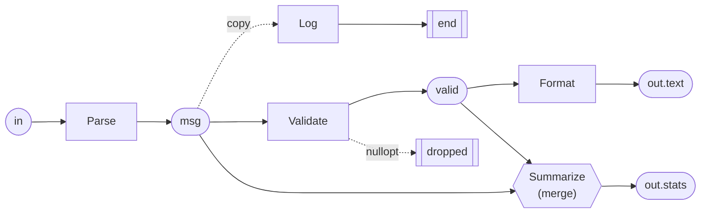

# filterGraph

A small, header-only C++20 library for building message/data processing
pipelines out of composable filter stages — both at **compile time** (fully
type-safe, zero-overhead composition) and at **runtime**, where a graph is
described in a small **text DSL** and type-checked when it is built.

It grew out of a need to turn a fixed sequence of transformation steps into a
flexible, reconfigurable **filter graph**: chain stages, fan out to parallel
paths, merge them back together, and drop/short-circuit messages — all without
hard-coding the pipeline shape in source code.

> **New here? Start with the [example walkthrough (EXAMPLE.md)](EXAMPLE.md)** —
> a step-by-step, diagrammed tour of the runnable
> [`apps/textPipeline`](apps/textPipeline/main.cpp) sample.

> **A note on the word "filter".** Here "filter" follows the Unix-pipeline and
> media-graph (DirectShow / GStreamer / FFmpeg) tradition: a stage that reads a
> value and writes a transformed one, not merely a predicate that keeps or
> drops. A `MessageFilter` therefore *transforms* (its input and output types
> may differ), and may *optionally* drop a message via `std::nullopt`. If you
> expect "filter" in the strict select-only sense, read it as "stage" or
> "processing step".

## At a glance

Stages are C++ classes registered under a name. A graph wires them together
with named edges:

```text
in    -> Parse -> msg
msg   -> Log -> end                        # a second reader of msg: gets its own copy
msg   -> Validate -> valid -> Format -> out.text
(msg, valid) -> Summarize -> out.stats     # fan-in through a merge stage
```



Each stage consumes a value and returns an `std::optional`; `std::nullopt`
drops the message, and everything downstream of that edge is skipped.

## Features

### Stages and compile-time graphs

- **`MessageFilter<InputType, OutputType>`** — the base stage interface. A
  filter consumes `InputType&&` and returns `std::optional<OutputType>`;
  returning `std::nullopt` short-circuits (drops) the message. The framework
  handles the short-circuit: later stages never receive an empty optional, so a
  stage only decides whether to emit `std::nullopt` itself.
- **`Void`** — an explicit terminal marker type. A stage declared
  `MessageFilter<InputType, Void>` is a pure side-effect *sink*: it produces no
  consumable output, which is distinct from returning `std::nullopt` (a
  *dropped* message).
- **`FilterGraph<Filters...>`** — compile-time, variadic-template composition
  of stages. Each stage's `OutType` must match the next stage's `InType`; zero
  runtime configuration overhead.
- **`SinkFilter<InputType>`** — a generic terminal stage that forwards data to
  a caller-supplied `std::function` callback.
- **`GraphContext`** — a graph-scoped, type-keyed, thread-safe blackboard, so
  stages can share values without knowing who produced them. See
  [Graph context](#graph-context).

### Runtime graphs in the text DSL

- **`FilterRegistry`** / **`FilterRegistrar<FilterImpl>`** — a global registry
  mapping names to stage factories, so a graph description can select and
  configure stages by name.
- **`DslFilterGraph<InputType, OutputType>`** — builds a graph from DSL text
  and exposes it as a regular `MessageFilter`, so it plugs in anywhere a
  compile-time graph can (including as a registered stage inside another
  graph). Construction instantiates every stage and checks the whole graph up
  front: syntax, unknown stage names (with a "did you mean"), bad config, type
  mismatches along every edge, fan-in and `Void` misuse, and the output shape.
- **`GraphOutputs`** — the result of a graph with several, optionally named,
  outputs of different types (`DslFilterGraph<In, GraphOutputs>`).
- **`MergeFilter<OutputType>`** / **`registerMergeFilter`** — fan-in stages:
  a C++ combiner turns the values of several edges into one, seeing an empty
  slot ("hole") for every edge whose path dropped the message.
- **`TypedMergeFilter<Out, Ins...>`** / **`UniformMergeFilter<In, Out>`** /
  **`registerTypedMergeFilter`** — fan-in stages that declare their slot types,
  so the edges of a group are checked when the graph is built and the stage
  receives typed `std::optional`s instead of `std::any`.
- **`validateDslGraph<In, Out>(text)`** — the same checks as construction,
  returned as a list of `line:column` diagnostics instead of a thrown
  **`GraphError`**.
- **`dsl::parseGraphProgram`** / **`dsl::toMermaid`** — parse a graph into its
  node/edge form and render it as a Mermaid flowchart. The parser is built on
  [lexy](https://github.com/foonathan/lexy); the earlier hand-written parser is
  deprecated (`dsl::parseGraphProgramHandwritten` in `GraphLangHandwritten.hpp`).

### JSON format (still supported)

- **`JsonFilterGraph<InputType, OutputType>`** / **`AnyFilterChain`** — build
  a chain from a JSON array of stages.
- **`FanoutFilter<InputType>`** / **`JoinFilter<InputType, OutputType>`** —
  the JSON format's composite stages for side branches and scatter-gather.
- **`validateGraph(json)`** — pre-flight validation of a JSON config, located
  by JSON pointers.
- **`AnyMessageFilter`** / **`AnyMessageFilterAdapter<Filter>`** — the
  type-erased stage view that both runtime formats are built on.

## Prerequisites

- A **C++20** compiler (MSVC 19.3x, GCC 11+, or Clang 14+). The library uses
  `std::format`, `<ranges>`, and other C++20 features.
- **CMake ≥ 3.22** (the presets require CMake ≥ 3.21).
- A build generator such as **Ninja** (used by the bundled presets).
- [nlohmann/json](https://github.com/nlohmann/json) (v3.11.3) and
  [lexy](https://github.com/foonathan/lexy) (v2025.05.0) — fetched
  automatically via CPM; no manual install needed.
- Building the tests additionally fetches [Catch2](https://github.com/catchorg/Catch2)
  (v3.5.2) via CPM.

The library itself is **header-only**: consumers only need a C++20 compiler,
nlohmann/json and lexy.

## Installation (CPM)

```cmake
CPMAddPackage(
    NAME filterGraph
    GITHUB_REPOSITORY "psyinf/filterGraph"
    GIT_TAG v0.2.0 # or main
)

target_link_libraries(myTarget PRIVATE filterGraph::filterGraph)
```

`filterGraph` depends on [nlohmann/json](https://github.com/nlohmann/json) and
[lexy](https://github.com/foonathan/lexy), which are pulled in transitively
via CPM.

## Quick start

### Compile-time pipeline

```cpp
#include <filterGraph/core/filterGraph/FilterGraph.hpp>
#include <filterGraph/core/filterGraph/MessageFilter.hpp>

using filterGraph::FilterGraph;
using filterGraph::MessageFilter;

class Double : public MessageFilter<int>
{
public:
    std::optional<int> filter(int&& value) override { return value * 2; }
};

class ToString : public MessageFilter<int, std::string>
{
public:
    std::optional<std::string> filter(int&& value) override { return std::to_string(value); }
};

FilterGraph<Double, ToString> pipeline(std::make_shared<Double>(), std::make_shared<ToString>());
auto result = pipeline.filter(21); // -> "42"
```

### Runtime pipeline in the DSL, with a tap

```cpp
#include <filterGraph/core/filterGraph/DslFilterGraph.hpp>
#include <filterGraph/core/filterGraph/FilterRegistry.hpp>

#include <iostream>

using namespace filterGraph;

// A side-effecting "tap": logs every value it sees, then passes it on.
class Log : public MessageFilter<int>
{
public:
    std::optional<int> filter(int&& value) override
    {
        std::cout << "[log] " << value << '\n';
        return value;
    }
};

// Register each stage under the name the graph uses. The registration happens
// in FilterRegistrar's constructor, so these are just static objects; their
// variable names are arbitrary and never referenced again.
static FilterRegistrar<Double>   registerDouble("Double");
static FilterRegistrar<ToString> registerToString("ToString");
static FilterRegistrar<Log>      registerLog("Log");

// Both statements read `in`, so each receives its own copy: the first logs it
// and discards the result at `end`; the second doubles it and turns it into
// the graph's string output.
DslFilterGraph<int, std::string> pipeline(R"dsl(
    in -> Log -> end
    in -> Double -> doubled -> ToString -> out
)dsl");

auto result = pipeline.filter(21); // logs "[log] 21"; result -> "42"
```

If the text had a typo, a config error or a type mismatch, the constructor
would throw a `GraphError` listing every problem with its `line:column`.

**For a complete, diagrammed walkthrough — fan-in merges, named outputs,
diagnostics and the JSON format — see [EXAMPLE.md](EXAMPLE.md).**

## The graph language

A graph is a list of statements, one per line. Each statement alternates
**edges** and **stages**, joined by `->`:

```text
edge -> Stage -> edge -> Stage(key=value) -> edge
```

- **Edges** are names (`msg`, `valid`, ...) that carry one value per message.
  Every edge is written by exactly one stage and must be read by something.
- **Stages** are names registered with `FilterRegistrar` (or
  `registerMergeFilter`). A stage reads the edge to its left and writes the
  edge to its right.
- **Stage arguments** — `Name(key=value, ...)` — are passed to the stage's
  registered creator as a JSON object. Values can be numbers, `"strings"`,
  `true`/`false`, or barewords (read as strings). A stage without parentheses
  receives an empty object.
- **Reserved edge names:**

  | Name | Meaning |
  | --- | --- |
  | `in` | the graph's input; may only start a statement |
  | `out` | the graph's output; may only end a statement |
  | `out.<key>` | a named output (several outputs are ordered as written) |
  | `end` | a dead end: the value is discarded (required for `Void` stages) |

- **Fan-out:** read the same edge in several statements. Every reader gets its
  own copy of the value.
- **Fan-in:** `(a, b, c) -> Merge -> merged` gathers several edges into a merge
  stage, one slot per edge, in the order listed. A merge either declares its
  slot types (see [Typed merges](#typed-merges)) or takes them untyped as
  `MergeInputs` (`std::vector<std::any>`), as
  `registerMergeFilter<OutputType>(name, combiner)` does.
- `#` starts a comment that runs to the end of the line.

### How a graph runs

For every message:

1. Stages run in the order they are written, except that a stage waits until
   every edge it reads has been produced.
2. Every reader of an edge gets its own copy (the last reader receives it by
   move).
3. A stage returning `std::nullopt` leaves its edge empty; stages reading an
   empty edge are skipped, so the drop propagates downstream.
4. A merge receives an empty slot (a "hole") for each dropped edge. It is
   skipped only when *all* of its edges are empty.
5. Values routed to `end` are discarded.

### Typed merges

A merge stage may declare the type of each of its slots. The DSL then checks
the edges of its group when the graph is built, like every other edge, instead
of failing with a `std::bad_any_cast` on the first message — and the stage
receives typed `std::optional`s, so it needs no `any_cast` of its own:

```cpp
// Fixed arity, one type per slot.
class Summarize : public TypedMergeFilter<Stats, Message, Valid>
{
public:
    std::optional<Stats> merge(std::optional<Message>&& message, std::optional<Valid>&& valid) override
    {
        return Stats{...}; // an empty optional is a hole: that path dropped the message
    }
};
static FilterRegistrar<Summarize> registerSummarize("Summarize");

// The same from a lambda, without a subclass.
registerTypedMergeFilter<Stats, Message, Valid>(
    "Summarize",
    [](std::optional<Message>&& message, std::optional<Valid>&& valid) -> std::optional<Stats> { ... });

// Any number of slots, all of one type: N variants of the same computation.
class PickBest : public UniformMergeFilter<Candidate, Result>
{
public:
    std::optional<Result> merge(std::vector<std::optional<Candidate>>&& candidates) override { ... }
};
```

Mis-wiring a group is then a build-time diagnostic, not a wrong result:

```text
4:34: slot 2 of 'Summarize' expects 'struct Valid' but edge 'msg' carries 'struct Message'
4:34: stage 'Summarize' takes 2 inputs but the group has 3
```

`MergeFilter` / `registerMergeFilter` declare no slot types; their edges stay
unchecked, and the combiner reads the slots with `std::any_cast`.

### Choosing the output type

`DslFilterGraph<InputType, OutputType>`'s `OutputType` states what the graph's
outputs must look like, and is checked at construction:

| `OutputType` | Graph must have | `filter()` returns |
| --- | --- | --- |
| a concrete type, e.g. `std::string` | exactly one `-> out` of that type | the value, or `std::nullopt` if it was dropped |
| `GraphOutputs` (the default) | one or more `-> out` / `-> out.<key>` | all outputs; `std::nullopt` only if every one was dropped |
| `Void` | no outputs, only `-> end` | `Void{}` |

```cpp
DslFilterGraph<std::string> analysis(R"dsl(
    in -> Uppercase -> out.upper
    in -> Length -> out.length
)dsl");

auto outputs = analysis.filter(std::string{"hello"});
outputs->get<std::string>("upper"); // std::optional<std::string>{"HELLO"}
outputs->get<std::size_t>(1);       // outputs can also be read by position
outputs->has("length");             // false if that output's path dropped the message
```

### Checking and visualizing a graph

`validateDslGraph` runs every construction check without running a message
and without throwing:

```cpp
for (const auto& d : validateDslGraph<std::string, int>(text))
{
    std::cerr << dsl::formatDiagnostic(d) << '\n';
}
```

```text
1:7: unknown stage type 'Uppercas' — did you mean 'Uppercase'?
2:7: could not construct 'MinLength': [json.exception.out_of_range.403] key 'minLength' not found
```

Syntax errors point at the offending token and say what was expected and what
was found, e.g. `1:17: expected '->' but found 'Print'`. A syntax error ends its
statement, so each line reports at most one and there are no follow-on errors
from half-parsed statements.

Type mismatches name the stage, the edge and both types. The type names come
from `typeid(...).name()`, so how they read depends on the compiler.

`dsl::toMermaid(dsl::parseGraphProgram(text))` (or
`dsl::toMermaid(graph.program())`) renders a graph as a Mermaid flowchart,
listing each stage's arguments.

### Current limitations

- Stage arguments are flat `key=value` pairs; nested objects and lists are not
  expressible yet. Stages that need them can be configured in JSON.
- Only the graph input type and the single `out` type are checked against the
  C++ template parameters; the types inside `GraphOutputs` are checked when
  they are read (`get<T>` throws `std::bad_any_cast` on a mismatch).

## Graph context

`GraphContext` (`GraphContext.hpp`) is a side channel for data that is not part
of the message, such as a frame number published by one stage and read by
another. The value's type is the key, so there is at most one value per type:

```cpp
struct FrameNo { std::uint64_t value; };   // wrap primitives in a dedicated type

auto ctx = std::make_shared<GraphContext>();
ctx->set(FrameNo{42});                                     // publish (replaces)
std::optional<FrameNo> frame = ctx->get<FrameNo>();        // nullopt if unset
FrameNo orDefault = ctx->getOr(FrameNo{0});
ctx->update<FrameNo>([](FrameNo& f) { ++f.value; });       // atomic; false if unset
```

- Values are copied in and out under an internal lock, so a context can be
  shared by concurrently running paths. Store `std::shared_ptr<T>` for heavy or
  non-copyable data. The callback given to `update` must not access the context.
- `GraphContext` is a polymorphic base: derive an application context, pass it
  around as `std::shared_ptr<GraphContext>`, and recover it with
  `ctx->as<AppContext>()` (`nullptr` if it is another type). Members added by a
  derived class are not covered by the lock, and a stage calling `as<>` depends
  on that type, so reusable stages should stick to `set` / `get`.
- The context is graph-scoped, not per message: if the graph ever buffers or
  reorders messages, a value such as a frame number may belong to another
  message than the one being processed.

There is always a context, so a stage never has to check for one. A stage
reads it through `MessageFilter::context()`, which returns a `GraphContext&`:

```cpp
class StampFrame : public MessageFilter<Image>
{
public:
    std::optional<Image> filter(Image&& image) override
    {
        image.frame = context().getOr(FrameNo{0}).value;
        return std::move(image);
    }
};
```

Every graph type (`FilterGraph`, `DslFilterGraph`, `JsonFilterGraph`) creates
an empty context when it is built and hands it to its stages, and so does every
composite stage (`FanoutFilter`, `JoinFilter`, nested graphs), including to
receivers and paths added later. So stages of the same graph share one context
out of the box:

```cpp
DslFilterGraph<Image, Image> graph(text);
graph.context().set(FrameNo{1});     // the graph's own context
```

Call `setContext` to put a different context in its place — typically an
application's derived one, or a single context shared by several graphs:

```cpp
graph.setContext(ctx);               // replaces the graph's own context
```

A stage that is not part of a graph keeps its own empty context, which nobody
else sees: it works, but nothing is shared. Note that the graph a stage is
added to overwrites the stage's context with its own, so hand a shared context
to the graph rather than to individual stages. `setContext(nullptr)` installs a
fresh empty context rather than none.

`setContext` is not meant to be called while messages are being processed.
Custom composite stages override it to forward the context to their inner
stages; `MessageFilter::sharedContext()` returns the `std::shared_ptr` to pass
on.

## JSON format

The JSON format predates the DSL and remains fully supported; both use the
same registered stages. A pipeline (or a branch/path inside a composite stage)
is an array of stages:

```json
[
  { "type": "StageName" },
  { "type": "OtherStage", "config": { "someParam": 123 } }
]
```

- `type` is the name a filter was registered under via `FilterRegistrar`.
- `config` is optional and is passed verbatim to the filter's registered
  creator function.

JSON chains are linear. Branching is expressed with composite stages whose
config holds nested paths:

- **`Fanout`** (`registerFanoutFilter<T>`) — `"branches"`: side paths that each
  receive a copy and whose results are discarded; the original continues down
  the chain. In the DSL this is simply a second reader of an edge ending in
  `end`.
- **`Join`** (`registerJoinFilter<In, Out>`) — `"paths"`: scatter one message
  through N paths and combine their outputs with a C++ combiner. In the DSL
  this is several statements reading the same edge, followed by a merge.

```cpp
auto config = nlohmann::json::parse(R"([
    { "type": "Fanout", "config": { "branches": [
        [ { "type": "Log" } ]
    ] } },
    { "type": "Double" },
    { "type": "ToString" }
])");

JsonFilterGraph<int, std::string> pipeline(config); // same behaviour as the DSL quick start
```

`validateGraph(config)` checks a JSON config without running messages and
returns every problem, each located by a JSON pointer (e.g.
`/1/config/paths/0/0`). Unlike the DSL checks, it cannot see a graph's declared
input/output types, and type checking pauses across a `Fanout`/`Join`.

## Building & testing

The repository ships a set of CMake presets (see
[`CMakePresets.json`](CMakePresets.json)) covering MSVC, Clang and GCC in Debug
and Release. Pick the one matching your toolchain, e.g.:

```powershell
# Windows / MSVC (Release)
cmake --preset windows-msvc-release-user-mode
cmake --build --preset windows-msvc-release-user-mode
ctest --preset test-windows-msvc-release-developer-mode
```

```bash
# Linux or macOS / GCC (Release)
cmake --preset unixlike-gcc-release
cmake --build --preset unixlike-gcc-release
ctest --preset test-unixlike-gcc-release
```

Available configure presets include `windows-msvc-{debug,release}-{developer,user}-mode`,
`windows-clang-{debug,release}`, `unixlike-gcc-{debug,release}` and
`unixlike-clang-{debug,release}`. Test presets are prefixed with `test-` (only
the developer-mode / non-user-mode configurations register tests).

Testing is enabled by default (`-DENABLE_TESTING=ON`); pass
`-DENABLE_TESTING=OFF` to skip building the tests. Tests use Catch2 (fetched via
CPM) and live under `tests/`.

Run the bundled example directly after building:

```powershell
./out/build/windows-msvc-release-user-mode/apps/textPipeline/textPipeline
```

## Roadmap

Planned improvements, not yet implemented:

- **Track which stage short-circuited.** When a graph drops a message, neither
  `DslFilterGraph` nor `AnyFilterChain` currently tells the caller *which*
  stage returned `std::nullopt`. They should record the stage (name and
  location) and expose it, e.g. via an accessor or a richer result type, so
  callers can diagnose where a message was filtered out. (The `Void` type
  already distinguishes an *intentional* dead-end from a dropped message; this
  item covers observing *unintentional* drops.)

## License

MIT, see [LICENSE](LICENSE).
