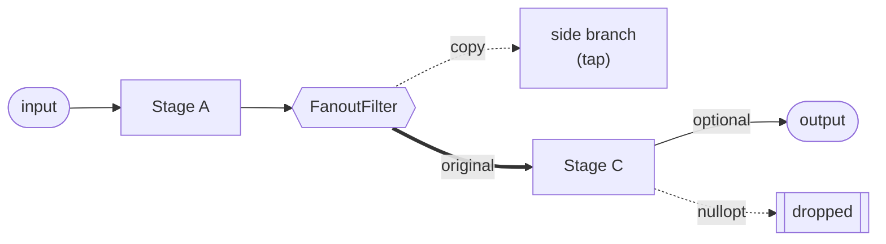

# filterGraph

A small, header-only C++20 library for building message/data processing
pipelines out of composable filter stages — both at **compile time** (fully
type-safe, zero-overhead composition) and at **runtime** (JSON-configured,
type-erased, with validation at construction time).

It grew out of a need to turn a fixed sequence of transformation steps into a
flexible, reconfigurable **filter graph**: chain stages, fan out to multiple
parallel branches, and drop/short-circuit messages — all without hard-coding
the pipeline shape in source code.

> **New here? Start with the [example walkthrough (EXAMPLE.md)](EXAMPLE.md)** —
> a step-by-step, diagrammed tour of the runnable
> [`apps/textPipeline`](apps/textPipeline/main.cpp) sample.

> **A note on the word "filter".** Here "filter" follows the Unix-pipeline and
> media-graph (DirectShow / GStreamer / FFmpeg) tradition: a stage that reads a
> value and writes a transformed one, not merely a predicate that keeps or
> drops. A `MessageFilter` therefore *transforms* (its input and output types
> may differ), and may *optionally* drop a message via `std::nullopt`. If you
> expect "filter" in the strict select-only sense, read it as "stage" or
> "processing step".

## At a glance

A pipeline is a chain of `MessageFilter` stages: each consumes a value and
returns an `std::optional`, where `std::nullopt` short-circuits (drops) the
message. A `FanoutFilter` can duplicate a message to parallel branches while
passing the original through unchanged.



See [EXAMPLE.md](EXAMPLE.md) for a full, diagrammed walkthrough of the runnable
[`apps/textPipeline`](apps/textPipeline/main.cpp) sample.

## Features

- **`MessageFilter<InputType, OutputType>`** — the base stage interface. A
  filter consumes `InputType&&` and returns `std::optional<OutputType>`;
  returning `std::nullopt` short-circuits (drops) the message, terminating
  the chain early. The short-circuit is handled by the framework
  (`FilterGraph` / `AnyFilterChain`): once a stage yields `std::nullopt`, no
  later stage runs and the whole chain returns `std::nullopt`. Downstream
  stages therefore never receive an empty optional — a stage only decides
  whether to emit `std::nullopt` itself and never has to handle one as input.
  Inside a `FanoutFilter` branch this termination is local to that branch and
  does not affect the main path (the branch result is discarded regardless).
- **`Void`** — an explicit terminal marker type. A path normally ends in a
  stage that produces a real `OutputType` (the graph's result). Declaring a
  stage `MessageFilter<InputType, Void>` instead marks the path as a pure
  side-effect *sink*: it produces no consumable output, distinct from returning
  `std::nullopt`, which means a message was *dropped* or could not be processed.
  A `Void` stage must be the last stage in a path; `AnyFilterChain` rejects any
  stage placed after it at construction time.
- **`FilterGraph<Filters...>`** — compile-time, variadic-template composition
  of stages. Fully type-checked at compile time; each stage's `OutType` must
  match the next stage's `InType`. Zero runtime configuration overhead.
- **`AnyMessageFilter`** / **`AnyMessageFilterAdapter<Filter>`** — type-erased
  view of a `MessageFilter`, used to store/chain stages of different
  (otherwise incompatible) types at runtime.
- **`FilterRegistry`** / **`FilterRegistrar<FilterImpl>`** — a global registry
  mapping string names to filter factories, so a runtime configuration (e.g.
  JSON) can select and construct filters by name. Supports both
  parameterless filters and filters configured from a JSON object.
- **`AnyFilterChain`** — builds and validates a sequence of stages ("a path")
  from a JSON array, resolving each stage via `FilterRegistry`. Fails fast at
  construction time if two consecutive stages' types don't match.
- **`validateGraph(json)` / `Diagnostic`** — pre-flight validation for a config.
  It walks the JSON *without running any messages* and returns **all** problems
  at once (not just the first), each located by a JSON pointer: unknown/typo'd
  stage types (with a nearest-name suggestion), structural mistakes, adjacent
  leaf type mismatches, and bad/missing per-stage `config`. Complements the
  fail-fast construction-time check with author-friendly, located diagnostics.
- **`JsonFilterGraph<InputType, OutputType>`** — a typed wrapper around
  `AnyFilterChain`, exposing it as a regular `MessageFilter<InputType,
  OutputType>` so a JSON-configured pipeline can be used anywhere a
  compile-time one can.
- **`FanoutFilter<InputType>`** — duplicates an incoming message across
  multiple independent, multi-stage branches (side-effecting "taps": logging,
  forwarding, metrics, ...), then passes the *original* message through
  unchanged to the rest of the chain. Each branch is itself an
  `AnyFilterChain`, so branches can have several stages, not just one. **No
  branch contributes to the pipeline's output**: every branch receives its own
  copy, runs to completion, and has its result discarded (a branch returning
  `std::nullopt` is a no-op for the main path). The value forwarded downstream
  is always the unchanged original input, regardless of the number or order of
  branches.
- **`SinkFilter<InputType>`** — a generic terminal stage that forwards data to
  a caller-supplied `std::function` callback and returns a simple status
  code, useful for terminating a compile-time `FilterGraph`.

## Prerequisites

- A **C++20** compiler (MSVC 19.3x, GCC 11+, or Clang 14+). The library uses
  `std::format`, `<ranges>`, and other C++20 features.
- **CMake ≥ 3.22** (the presets require CMake ≥ 3.21).
- A build generator such as **Ninja** (used by the bundled presets).
- [nlohmann/json](https://github.com/nlohmann/json) (v3.11.3) — fetched
  automatically via CPM; no manual install needed.
- Building the tests additionally fetches [Catch2](https://github.com/catchorg/Catch2)
  (v3.5.2) via CPM.

The library itself is **header-only**: consumers only need a C++20 compiler and
nlohmann/json.

## Installation (CPM)

```cmake
CPMAddPackage(
    NAME filterGraph
    GITHUB_REPOSITORY "psyinf/filterGraph"
    GIT_TAG v0.2.0 # or main
)

target_link_libraries(myTarget PRIVATE filterGraph::filterGraph)
```

`filterGraph` depends on [nlohmann/json](https://github.com/nlohmann/json),
which is pulled in transitively via CPM.

## Quick start

### Compile-time pipeline

```cpp
#include <filterGraph/core/filterGraph/FilterGraph.hpp>
#include <filterGraph/core/filterGraph/MessageFilter.hpp>

using filterGraph::FilterGraph;
using filterGraph::MessageFilter;

class Double : public MessageFilter<int>
{
public:
    std::optional<int> filter(int&& value) override { return value * 2; }
};

class ToString : public MessageFilter<int, std::string>
{
public:
    std::optional<std::string> filter(int&& value) override { return std::to_string(value); }
};

FilterGraph<Double, ToString> pipeline(std::make_shared<Double>(), std::make_shared<ToString>());
auto result = pipeline.filter(21); // -> "42"
```

### Runtime, JSON-configured pipeline with a parallel branch

```cpp
#include <filterGraph/core/filterGraph/FanoutFilter.hpp>
#include <filterGraph/core/filterGraph/FilterRegistry.hpp>
#include <filterGraph/core/filterGraph/JsonFilterGraph.hpp>

#include <iostream>

using namespace filterGraph;

// A side-effecting "tap": logs every value it sees, then passes it on
// unchanged. This is the kind of stage a fanout branch is meant for.
class Log : public MessageFilter<int>
{
public:
    std::optional<int> filter(int&& value) override
    {
        std::cout << "[log] " << value << '\n';
        return value;
    }
};

// Register each stage under a name. FilterRegistrar comes from filterGraph
// (FilterRegistry.hpp); the registration happens in its constructor, so these
// are just static objects — the variable names (registerDouble, ...) are
// arbitrary and never referenced again. The string is the name used in JSON.
static FilterRegistrar<Double>   registerDouble("Double");
static FilterRegistrar<ToString> registerToString("ToString");
static FilterRegistrar<Log>      registerLog("Log");
static const bool sRegisterFanout = [] { registerFanoutFilter<int>("Fanout"); return true; }();

// Tap the incoming value into a logging branch, then transform it on the main
// path: double it and turn it into a string.
auto config = nlohmann::json::parse(R"([
    { "type": "Fanout", "config": { "branches": [
        [ { "type": "Log" } ]
    ] } },
    { "type": "Double" },
    { "type": "ToString" }
])");

JsonFilterGraph<int, std::string> pipeline(config);
auto result = pipeline.filter(21); // branch logs "[log] 21"; main path -> "42"
```

The fanout branch observes the *original* input (`21`) as a side effect, while
the main path keeps flowing and produces the transformed result (`"42"`).

**For a complete, diagrammed walkthrough of these concepts, see
[EXAMPLE.md](EXAMPLE.md).** It builds on the runnable
[`apps/textPipeline`](apps/textPipeline/main.cpp) sample (a small text pipeline:
uppercase/reverse/print, with a JSON-configured variant including a fanout
branch and a length-based filter).

## JSON pipeline schema

A pipeline (or a `FanoutFilter` branch) is described as an array of stages:

```json
[
  { "type": "StageName" },
  { "type": "OtherStage", "config": { "someParam": 123 } }
]
```

- `type` is the name a filter was registered under via `FilterRegistrar`.
- `config` is optional and is passed verbatim to the filter's registered
  creator function; its shape is entirely up to that filter.

A `FanoutFilter`'s config has one special key, `branches`: an array where
each entry is itself a full stage array (a path), not a single stage:

```json
{
  "type": "Fanout",
  "config": {
    "branches": [
      [ { "type": "StageA" } ],
      [ { "type": "StageB" }, { "type": "StageC" } ]
    ]
  }
}
```

Branches are side-effect-only: each receives a copy of the message and its
result is discarded, so no branch contributes to the pipeline's output (the
fanout always forwards the unchanged original downstream).

### Validating a config

Construction throws on the first error with no location, which is awkward while
authoring. `validateGraph` checks a config up front — without running any
messages — and returns *every* problem it finds, each with a JSON pointer:

```cpp
#include <filterGraph/core/filterGraph/GraphValidator.hpp>

auto diagnostics = filterGraph::validateGraph(config);
for (const auto& d : diagnostics)
{
    std::cerr << d.pointer << ": " << d.message << '\n';
}
if (diagnostics.empty()) { /* safe to build the JsonFilterGraph */ }
```

Example output for a config with a typo and a nested mistake:

```text
/0: unknown filter type 'Uppercas' — did you mean 'Uppercase'? (known types: ...)
/1/config/paths/0/0: unknown filter type 'Revrse' — did you mean 'Reverse'? (known types: ...)
```

It detects unknown/typo'd `type` names (with a nearest-name suggestion and the
list of known types), structural errors (non-object stage, missing `type`, a
composite's sub-paths not being an array), adjacent leaf type mismatches, and
bad/missing per-stage `config` (leaf stages are constructed to check). It does
**not** check a graph's declared input/output types (those are C++ template
parameters, not JSON), and type-chaining pauses across a composite stage
(`Fanout`/`Join`), whose through-type is not knowable from JSON alone.

## Building & testing

The repository ships a set of CMake presets (see
[`CMakePresets.json`](CMakePresets.json)) covering MSVC, Clang and GCC in Debug
and Release. Pick the one matching your toolchain, e.g.:

```powershell
# Windows / MSVC (Release)
cmake --preset windows-msvc-release-user-mode
cmake --build --preset windows-msvc-release-user-mode
ctest --preset test-windows-msvc-release-developer-mode
```

```bash
# Linux or macOS / GCC (Release)
cmake --preset unixlike-gcc-release
cmake --build --preset unixlike-gcc-release
ctest --preset test-unixlike-gcc-release
```

Available configure presets include `windows-msvc-{debug,release}-{developer,user}-mode`,
`windows-clang-{debug,release}`, `unixlike-gcc-{debug,release}` and
`unixlike-clang-{debug,release}`. Test presets are prefixed with `test-` (only
the developer-mode / non-user-mode configurations register tests).

Testing is enabled by default (`-DENABLE_TESTING=ON`); pass
`-DENABLE_TESTING=OFF` to skip building the tests. Tests use Catch2 (fetched via
CPM) and live under `tests/`.

Run the bundled example directly after building:

```powershell
./out/build/windows-msvc-release-user-mode/apps/textPipeline/textPipeline
```

## Roadmap

Planned improvements, not yet implemented:

- **Track which stage short-circuited.** When a chain returns `std::nullopt`,
  `AnyFilterChain` currently gives no indication of *which* stage dropped the
  message. It should record the index/name of the stage that returned
  `std::nullopt` (and expose it to the caller, e.g. via an accessor or a
  richer result type) so callers can observe and diagnose where a message was
  filtered out. (The `Void` type already distinguishes an *intentional*
  dead-end from a dropped message; this item covers observing *unintentional*
  drops.)

## License

MIT, see [LICENSE](LICENSE).
